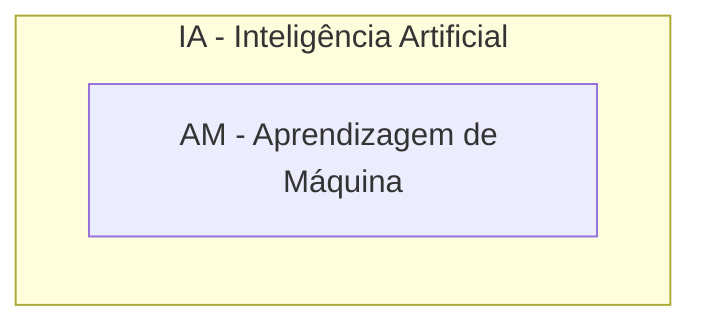
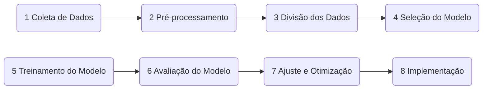

# Aprendizagem de máquina

## Introduçao

Nos primórdios da computação, os sistemas eram desenvolvidos predominantemente por meio de regras explícitas, codificadas manualmente pelos programadores. Esses sistemas, que seguiam uma lógica passo a passo, eram eficazes em contextos bem definidos e com variáveis controladas. No entanto, foi apenas a partir da década de 1970 que a Inteligência Artificial (IA) começou a ser explorada para resolver problemas mais complexos e dinâmicos, envolvendo situações do mundo real [1].

Os primeiros sistemas de IA, conhecidos como Sistemas Especialistas ou Baseados em Conhecimento, dependiam fortemente da colaboração com especialistas humanos para a extração e codificação do conhecimento em regras lógicas. Esses sistemas enfrentavam desafios significativos, como a dificuldade na modelagem do processo decisório dos especialistas e a subjetividade inerente à aquisição de conhecimento. A colaboração intensa e a necessidade de envolvimento contínuo dos especialistas humanos eram obstáculos adicionais que limitavam a escalabilidade e a aplicabilidade desses sistemas [2].

Com o aumento da complexidade dos problemas e o crescimento exponencial na quantidade de dados gerados por diversos setores, surgiram novas demandas por ferramentas computacionais mais avançadas e autônomas. Nesse contexto, o Aprendizado de Máquina (AM), uma subárea da IA, emergiu como uma solução promissora. 

Figura 1 - AM subárea da IA

O avanço da infraestrutura para coleta, armazenamento, processamento e distribuição de grandes volumes de dados, combinado com o progresso em diversas áreas tecnológicas, fomentou o desenvolvimento e a aplicação de técnicas de AM. Em seguida, a AM passou a ser amplamente adotada em diversos setores, tanto públicos quanto privados, expandindo o leque de aplicações e usuários [3] [4].

## Definição

A aprendizagem de máquina (ou machine learning, em inglês) é um subcampo da inteligência artificial (IA) que se concentra no desenvolvimento de algoritmos e modelos que permitem aos computadores aprenderem a partir de dados e fazerem previsões ou decisões sem serem explicitamente programados para isso. Em outras palavras, em vez de seguir instruções rígidas, os sistemas de aprendizagem de máquina identificam padrões nos dados e usam esses padrões para melhorar seu desempenho em tarefas específicas.

A aprendizagem de máquina também pode ser definida como um método de análise de dados que automatiza a construção de modelos analíticos. Utilizando algoritmos que iterativamente aprendem a partir dos dados, a aprendizagem de máquina permite que os computadores encontrem _insights_ ocultos sem serem explicitamente programados para procurar por eles.

## Etapas

O processo de aprendizagem de máquina envolve geralmente as  etapas disposta na Figura 2.

Figura 2 - Etapas aprendizagem de máquina

1. Coleta de Dados: O primeiro passo é coletar dados relevantes que serão usados para treinar o modelo. Esses dados podem vir de diversas fontes, como bancos de dados, sensores, arquivos de log, entre outros.
 
2. Pré-processamento de Dados: Antes de serem usados, os dados precisam ser limpos e preparados. Isso inclui a remoção de valores ausentes, normalização de variáveis e transformação de dados categóricos em numéricos.
 
3. Divisão dos Dados: Os dados são divididos em conjuntos de treinamento e teste. O conjunto de treinamento é usado para treinar o modelo, enquanto o conjunto de teste é usado para avaliar seu desempenho.
 
4. Seleção do Modelo: Escolhe-se um algoritmo de aprendizagem de máquina adequado para a tarefa. Existem diversos algoritmos disponíveis, cada um com suas próprias vantagens e desvantagens.
 
5. Treinamento do Modelo: O modelo é treinado utilizando o conjunto de dados de treinamento. Durante o treinamento, o modelo ajusta seus parâmetros internos para minimizar o erro nas previsões.
 
6. Avaliação do Modelo: Após o treinamento, o modelo é avaliado utilizando o conjunto de dados de teste. Métricas como precisão, recall e F1-score são usadas para medir o desempenho do modelo.

7. Ajuste e Otimização: Com base na avaliação, o modelo pode ser ajustado e otimizado para melhorar seu desempenho. Isso pode incluir a seleção de novos hiperparâmetros ou a utilização de técnicas de regularização.

Atualmente, as aplicações de AM abrangem uma vasta gama de áreas, como organização de fotografias, sistemas de recomendação, filtros anti-spam, e reconhecimento de padrões em contextos variados, incluindo diagnósticos médicos, detecção de fraudes, e até mesmo o desenvolvimento de veículos autônomos. Essas aplicações são geralmente baseadas na construção de modelos que representam o conhecimento embutido em **conjuntos de dados**, frequentemente organizados em formato tabular. 

## Conjunto de dados

Um conjunto de dados em aprendizagem de máquina é uma coleção estruturada de dados que é utilizada para treinar, validar e testar modelos preditivos. Esses conjuntos de dados são essenciais para o processo de aprendizagem, pois permitem que os modelos aprendam a partir de exemplos, identificando padrões e fazendo previsões sobre novos dados.

Em muitos casos, os conjuntos de dados são representados em um formato tabular, como uma planilha ou uma tabela de banco de dados. Nesse formato, as linhas correspondem a instâncias ou exemplos, e as colunas correspondem a atributos ou características que descrevem essas instâncias. O formato tabular pode ser visto como uma matriz de atributo-valor, onde cada linha representa uma instância (ou exemplo) e cada coluna representa um atributo (ou característica). Um atributo pode ser uma variável numérica, categórica, ou qualquer outra característica que descreva a instância.

Os atributos podem ser classificados como preditivos e alvo. Os atributos preditivos são os atributos que são usados pelo modelo para fazer previsões. Eles representam as características observáveis ou medíveis das instâncias. O atributo alvo é o atributo que o modelo tenta prever. 

Em cenários onde os dados possuem um atributo alvo, como em tarefas de classificação ou regressão, o modelo tenta prever o valor desse atributo com base nos atributos preditivos. 

## Classificação

No âmbito da aprendizagem de máquina, as tarefas são tradicionalmente classificadas em duas categorias **preditivas** e **descritivas** (veja Figura~\ref{fig:catagoriasam}). As tarefas preditivas, associadas à aprendizagem supervisionada, têm como objetivo prever um atributo alvo para novas instâncias, baseando-se no treinamento realizado com dados previamente rotulados \cite{bishop2006pattern}. Por outro lado, as tarefas descritivas, que se enquadram na aprendizagem não supervisionada, buscam identificar padrões e relações entre os atributos preditivos sem a necessidade de um atributo alvo \cite{hastie2009elements}.

Especificamente, nas tarefas preditivas, os modelos analisam os atributos preditivos e os comparam com os atributos alvo durante o processo de treinamento. Já nas tarefas descritivas, a análise é feita entre os próprios atributos preditivos, com o objetivo de descobrir padrões subjacentes e correlações, sem um rótulo explícito para guiar o processo \cite{murphy2012machine}. Esta distinção é fundamental para compreender as diferentes abordagens e aplicações da aprendizagem de máquina em diversos contextos.

Embora essa divisão entre modelos preditivos e descritivos seja amplamente aceita, há casos em que as fronteiras entre essas categorias podem se tornar nebulosas. O aprendizado \textbf{semissupervisionado}, por exemplo, utiliza tanto dados rotulados quanto não rotulados para realizar tarefas que podem ser preditivas ou descritivas, dependendo do contexto \cite{zhu2009introduction}. De forma semelhante, o \textbf{aprendizado ativo} envolve a seleção estratégica de dados rotulados ou não rotulados para otimizar o treinamento do modelo \cite{settles2012active}. O \textbf{aprendizado por reforço}, por sua vez, explora interações com o ambiente através de feedbacks positivos ou negativos para aprender a partir das consequências das ações \cite{sutton1998reinforcement}.

## Generalização e viés

A capacidade de generalização é um dos objetivos principais em algoritmos de aprendizagem de máquina. Isso significa que as regras aprendidas durante o treinamento devem ser aplicáveis a novos dados não vistos anteriormente, pertencentes ao mesmo domínio ou problema \cite{goodfellow2016deep}. No entanto, essa generalização pode ser prejudicada pelo \textbf{overfitting}, onde o modelo se torna excessivamente ajustado aos dados de treinamento, resultando em uma baixa capacidade de generalização. Por outro lado, o \textbf{underfitting} ocorre quando o modelo é incapaz de capturar os padrões subjacentes nos dados, geralmente devido à simplicidade excessiva do modelo ou à inadequação dos dados de treinamento \cite{murphy2012machine}.

Nos algoritmos de aprendizagem de máquina, a lógica indutiva desempenha um papel fundamental, permitindo que o modelo infira conclusões gerais a partir de exemplos específicos \cite{bishop2006pattern}. Essa abordagem é essencial para o modelo ser capaz de lidar com informações imperfeitas, que podem conter ruídos, incompletudes, ambiguidades e inconsistências. Tais imperfeições, embora não possam ser completamente eliminadas, devem ser minimizadas para reduzir seu impacto na fase de indução, permitindo ao modelo extrair padrões significativos a partir dos dados disponíveis \cite{hastie2009elements}.

O conceito de viés indutivo é central para o funcionamento dos algoritmos de aprendizagem de máquina. O viés indutivo refere-se à maneira como o algoritmo correlaciona os atributos preditivos com o atributo alvo, restringindo os modelos a serem avaliados no espaço de busca. Existem diferentes tipos de viés, como o viés de \textbf{representação}, que impõe restrições ao espaço dos modelos possíveis com base na forma ou linguagem preferida, e o viés de \textbf{busca}, que impõe restrições com base na estratégia de busca utilizada pelo algoritmo \cite{mitchell1997machine}.

O viés de representação se refere às restrições impostas sobre a forma como os dados são representados dentro do modelo. Em termos simples, trata-se de como o modelo ``vê'' os dados. Se a representação escolhida não for adequada, o modelo pode não ser capaz de capturar padrões importantes, limitando sua eficácia. Por exemplo, se um modelo só puder representar relações lineares entre variáveis, ele terá dificuldade em aprender padrões mais complexos. 

O viés de busca se refere às restrições impostas sobre como o modelo procura pela melhor solução ou padrão nos dados. Mesmo que a representação seja adequada, se o processo de busca for limitado, o modelo pode não explorar todas as possibilidades ou otimizações, levando a uma solução subótima. Isso pode ocorrer se, por exemplo, o algoritmo de treinamento convergir muito rapidamente para uma solução local, sem explorar outras soluções potencialmente melhores.

Embora à primeira vista o viés possa parecer uma limitação, ele é essencial para a capacidade do algoritmo de generalizar o conhecimento adquirido durante o treinamento. Sem viés, um algoritmo de aprendizagem de máquina seria incapaz de realizar essa generalização de forma eficaz, tornando-se incapaz de aplicar o conhecimento a novos dados \cite{faceli2023aprendizado}. Portanto, o viés indutivo, quando bem calibrado, é uma ferramenta poderosa que permite ao algoritmo equilibrar a complexidade e a generalização, maximizando seu desempenho em tarefas do mundo real.

## Referências

[1] Faceli, K., Lorena, A. C., Gama, J., Almeida, T. A. de, & Carvalho, A. C. P. de L. F. de. (2021). Inteligência artificial: uma abordagem de aprendizado de máquina. Rio de Janeiro: LTC.  

[^2]: feigenbaum1982knowledge

[^3]: jordan2015machine

[^4]: domingos2015master}
