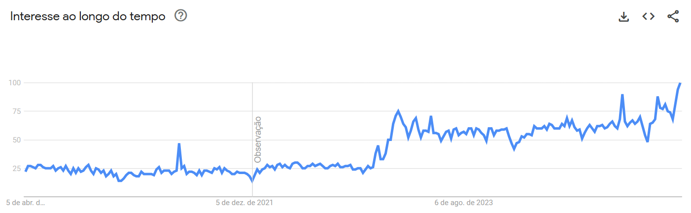
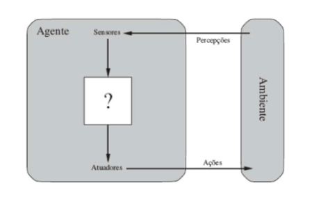
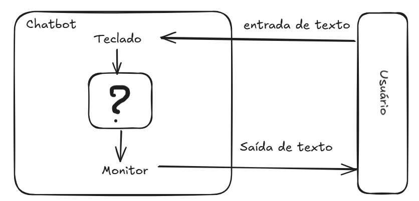
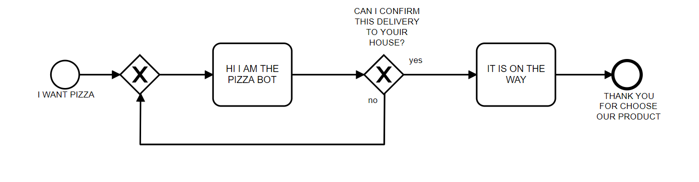

# Chatbots: Definições e Contexto

## Introdução

Um chatbot é um programa de computador que simula uma conversa humana,
geralmente utilizando texto ou áudio. Eles oferecem respostas diretas a
perguntas e auxiliam em diversas tarefas, servindo tanto para conversas
gerais quanto para ações específicas, como abrir uma conta bancária.

Embora o chatbot ELIZA [@Weizenbaum1996] seja frequentemente considerado
um dos primeiros exemplos de software conversacional, o termo "chatbot"
ainda não era utilizado na época de sua criação. O termo "chatterbot",
sinônimo de "chatbot", foi popularizado por Michael Mauldin em 1994, ao
descrever seu programa JULIA [@Mauldin1994]. Publicações acadêmicas,
como os anais da *Virtual Worlds and Simulation Conference* de 1998
[@Jacobstein1998], também ajudaram a consolidar o uso do termo.

O ELIZA, criado em 1966 por Joseph Weizenbaum, representou um
experimento revolucionário na interação humano-computador
[@Weizenbaum1996]. Seu roteiro (ou script) mais famoso, DOCTOR, imitava
rudimentarmente um psicoterapeuta, utilizando correspondência de padrões
simples. Por exemplo, quando um usuário inseria a frase "Estou triste",
o ELIZA respondia "Por que você está triste hoje?", reformulando a
entrada como uma pergunta. Seu funcionamento baseia-se em um conjunto de
regras que lhe permitem analisar e compreender a linguagem humana de
forma limitada e aproximada.

Esse tipo de aplicação do ELIZA (simular um psicólogo muito rudimentar
da técnica rogeriana) adequou-se bem a esse domínio, pois dependia de
pouco conhecimento sobre o ambiente externo; as regras no script DOCTOR
permitiam que o programa respondesse ao usuário com outras perguntas ou
simplesmente refletisse a afirmação original. O ELIZA não possuía uma
real "compreensão" da linguagem humana; ele apenas utilizava
palavras-chave e manipulava frases para que a interação parecesse
natural. Uma descrição detalhada do funcionamento do ELIZA, com exemplos
em Python, será apresentada em seções posteriores deste livro.

Outro chatbot famoso é o ChatGPT. Desenvolvido pela OpenAI, este é um
modelo de linguagem capaz de gerar texto muito semelhante ao criado por
humanos. Ele utiliza aprendizagem profunda (deep learning) e redes
neurais para gerar sentenças e parágrafos com base nas entradas e
informações fornecidas. É capaz de produzir textos coerentes e até mesmo
realizar tarefas simples, como responder a perguntas e gerar ideias.
Contudo, é importante lembrar que o ChatGPT não possui consciência nem a
capacidade de compreender contexto ou emoções. Ele é um exemplo de
Modelo de Linguagem Grande (Large Language Model - LLM), baseado na
arquitetura conhecida como Transformers, introduzida em 2017
[@Vaswani2017]. Esses modelos são treinados com terabytes de texto,
utilizando mecanismos de autoatenção que avaliam a relevância de cada
palavra em uma frase. Ao contrário das regras manuais do ELIZA, os LLMs
extraem padrões linguísticos a partir da vasta quantidade de dados com
que a rede neural foi treinada.

Esses dois chatbots, ELIZA e ChatGPT, são bons representantes do tipo
**conversacional**. Apesar de terem surgido com décadas de diferença ---
ELIZA em 1966 e ChatGPT em 2022 --- e de diferirem bastante na forma
como geram suas respostas, ambos compartilham semelhanças em seu
objetivo: conversar sobre determinado assunto ou responder perguntas,
mantendo o usuário em um diálogo fluido quando necessário. Chatbots com
essas características podem ser agrupados, de acordo com o objetivo,
como chatbots conversacionais e são utilizados para interagir sobre
assuntos gerais.

Outro tipo de chatbot classificado em relação ao objetivo é o
**orientado a tarefas**. Os chatbots orientados a tarefas executam ações
específicas, como abrir uma conta bancária ou pedir uma pizza.
Geralmente, as empresas disponibilizam chatbots orientados a tarefas
para seus usuários, com regras de negócio embutidas na conversação e com
fluxos bem definidos. Normalmente, não se espera pedir uma pizza e, no
mesmo chatbot, discutir os estudos sobre Ética do filósofo Immanuel Kant
(embora talvez haja quem queira).

Essas duas classificações - conversacional e orientado a tarefas -
(Figura [1.1](#fig:tipo){reference-type="ref" reference="fig:tipo"})
ainda não são suficientes para uma completa classifição dada diversas
caractéristicas e enorme quantidade de chatbots existentes. Existem
outras classificações que serão discutidas em seções posteriores.

<figure id="fig:tipo">

<figcaption>Classificação chatbots.</figcaption>
</figure>

A popularidade dos chatbots tem crescido significativamente em diversos
domínios de aplicação [@B2020; @Klopfenstein2017; @Sharma2020]. Essa
tendência é corroborada pelo aumento do interesse de busca pelo termo
"chatbots", conforme análise de dados do Google Trends no período entre
2020 e 2025 (Figura [1.2](#fig:trends){reference-type="ref"
reference="fig:trends"}). Nesta figura, os valores representam o
interesse relativo de busca ao longo do tempo, onde 100 indica o pico de
popularidade no período analisado e 0 (ou a ausência de dados) indica
interesse mínimo ou dados insuficientes.

<figure id="fig:trends">

  Fonte: Google
Trends acesso em 05/04/2025

<figcaption>Evolução do interesse de busca pelo termo “chatbot” (Google
Trends, 2020-2025).</figcaption>
</figure>

## Chatbots e Agentes: Definições e Distinções

Define-se chatbot como um programa computacional projetado para
interagir com usuários por meio de linguagem natural. Por outro lado, o
conceito de agente possui uma definição mais ampla: trata-se de uma
entidade computacional que percebe seu ambiente por meio de sensores e
atua sobre esse ambiente por meio de atuadores [@Russel2013]. A
Figura [1.3](#fig:agente){reference-type="ref" reference="fig:agente"}
ilustra uma arquitetura conceitual de alto nível para um agente.

<figure id="fig:agente">

 

Fonte: Diretamente retirado de 

<figcaption>Arquitetura conceitual de um agente.</figcaption>
</figure>

Nesse contexto, um chatbot
(Figura [1.4](#fig:chatbot){reference-type="ref"
reference="fig:chatbot"}) pode ser considerado uma instanciação
específica de um agente, cujo propósito primário é a interação
conversacional em linguagem natural.

<figure id="fig:chatbot">

 

<figcaption>Representação esquemática de um chatbot.</figcaption>
</figure>

Com o advento de modelos de linguagem avançados, como os baseados na
arquitetura *Generative Pre-trained Transformer* (GPT), a exemplo do
ChatGPT, observou-se uma recontextualização do termo "agente" no domínio
dos sistemas conversacionais. Nessa abordagem mais recente, um sistema
focado predominantemente na geração de texto conversacional tende a ser
denominado "chatbot". Em contraste, o termo "agente" é frequentemente
reservado para sistemas que, além da capacidade conversacional, integram
e utilizam ferramentas externas (por exemplo, acesso à internet,
execução de código, interação com APIs) para realizar tarefas complexas
e interagir proativamente com o ambiente digital. Um sistema capaz de
realizar uma compra online, processar um pagamento e confirmar um
endereço de entrega por meio do navegador do usuário seria, portanto,
classificado como um agente, diferentemente de chatbots mais simples
como ELIZA, ou mesmo versões mais simples do chatGPT (GPT-2), cujo foco
era estritamente o diálogo.

## Gerenciamento do Diálogo e Fluxo Conversacional

Um chatbot responde a uma entrada do usuário. Porém, essa interação
textual mediada por chatbots não se constitui em uma mera justaposição
aleatória de turnos de conversação ou pares isolados de
estímulo-resposta. Pelo contrário, espera-se que a conversação exiba
coerência e mantenha relações lógicas e semânticas entre os turnos
consecutivos. O estudo da estrutura e organização da conversa humana é
abordado por disciplinas como a Análise da Conversação.

No contexto da da análise da conversação em língua portuguesa, os
trabalhos de Marcuschi [@Marchuschi1986] são relevantes ao investigar a
organização dessa conversação. Marcuschi analisou a estrutura
conversacional em termos de unidades coesas, como o "tópico
conversacional", que agrupa turnos relacionados a um mesmo assunto ou
propósito interacional.

Conceitos oriundos da Análise da Conversação, como a gestão de tópicos,
têm sido aplicados no desenvolvimento de chatbots para aprimorar sua
capacidade de manter diálogos coerentes e contextualmente relevantes com
usuários humanos [@Neves2005].

Na prática de desenvolvimento de sistemas conversacionais, a estrutura
lógica e sequencial da interação é frequentemente modelada e referida
como "fluxo de conversação" ou "fluxo de diálogo". Contudo, é importante
ressaltar que a implementação explícita de modelos sofisticados de
gerenciamento de diálogo, inspirados na Análise da Conversação, não é
uma característica universal de todos os chatbots, variando conforme a
complexidade e o propósito do sistema.

Um exemplo esquemático de um fluxo conversacional é apresentado na
Figura [1.5](#fig:fluxo){reference-type="ref" reference="fig:fluxo"}.
Nesta figura o fluxo de conversação inicia quando o usuário entra com o
texto: I WANT PIZZA, o chatbot responde com uma pergunta: HI I AM THE
PIZZA BOT. CAN I CONFIRM THIS DELIVERY TO YOUR HOUSE?. O usuário então
pode responder: SIM e o chatbot finaliza a conversa com: IT'S ON THE
WAY. THANK YOU FOR CHOOSE OUR PRODUCT. Caso o usuário responda: NO, o
chatbot responde com a pergunta original: HI I AM THE PIZZA BOT. CAN I
CONFIRM THIS DELIVERY TO YOUR HOUSE?. O fluxo de conversação continua
até que o usuário responda com um "sim" para a pergunta inicial. Essa
estrutura de perguntas e respostas é comum em chatbots orientados a
tarefas, onde o objetivo é guiar o usuário por um processo específico,
como fazer um pedido de pizza.

<figure id="fig:fluxo">

 

<figcaption>Exemplo esquemático de um fluxo conversacional em um
chatbot.</figcaption>
</figure>

Um outro tipo de fluxo para um chatbot que vende roupas está
representada na
Figura [1.6](#fig:representacaodeumaarvore){reference-type="ref"
reference="fig:representacaodeumaarvore"}.

<figure id="fig:representacaodeumaarvore">

 

Retirado de .

<figcaption>Representação de uma árvore de decisão para comprar roupas
online</figcaption>
</figure>

## Depois do ELIZA

Um marco significativo na evolução dos chatbots foi o ALICE, que
introduziu a Artificial Intelligence Markup Language (AIML), uma
linguagem de marcação baseada em XML [@Wallace2000]. A AIML estabeleceu
um paradigma para a construção de agentes conversacionais ao empregar
algoritmos de correspondência de padrões. Essa abordagem utiliza modelos
pré-definidos para mapear as entradas do usuário a respostas
correspondentes, permitindo a definição modular de blocos de
conhecimento [@Wallace2000].

No contexto brasileiro, um dos primeiros chatbots documentados capaz de
interagir em português, inspirado no modelo ELIZA, foi o Cybele
[@primo2001chatterbot]. Posteriormente, foi desenvolvido o Elecktra,
também em língua portuguesa, com aplicação voltada para a educação a
distância [@Leonhardt2003]. Em um exemplo mais recente de aplicação
governamental, no ano de 2019, o processo de inscrição para o Exame
Nacional do Ensino Médio (ENEM) foi disponibilizado por meio de uma
interface conversacional baseada em chatbot
(Figura [1.7](#fig:enem){reference-type="ref" reference="fig:enem"}).

<figure id="fig:enem">

 

Fonte: Captura de tela realizada por Giseldo Neo.

<figcaption>Interface de chatbot para inscrição no ENEM
2019.</figcaption>
</figure>

O desenvolvimento de chatbots avançados tem atraído investimentos de
grandes corporações. Notavelmente, a IBM desenvolveu um sistema de
resposta a perguntas em domínio aberto utilizando sua plataforma Watson
[@Ferrucci2012]. Esse tipo de tarefa representa um desafio computacional
e de inteligência artificial (IA) considerável. Em 2011, o sistema
baseado em Watson demonstrou sua capacidade ao competir e vencer
competidores humanos no programa de perguntas e respostas JEOPARDY!
[@Ferrucci2012].

Diversos outros chatbots foram desenvolvidos para atender a demandas
específicas em variados domínios. Exemplos incluem: BUTI, um companheiro
virtual com computação afetiva para auxiliar na manutenção da saúde
cardiovascular [@Junior2008]; EduBot, um agente conversacional projetado
para a criação e desenvolvimento de ontologias com lógica de descrição
[@Lima2017]; PMKLE, um ambiente inteligente de aprendizado focado na
educação em gerenciamento de projetos [@Torreao2005]; RENAN, um sistema
de diálogo inteligente fundamentado em lógica de descrição
[@AZEVEDO2015]; e MOrFEu, voltado para a mediação de atividades
cooperativas em ambientes inteligentes na Web [@Bada2012].

Entre os chatbots baseado em LLMs de destaque atualmente estão o Qwen,
desenvolvido pela Alibaba, que se destaca por sua eficiência e suporte
multilíngue; o DeepSeek, de código aberto voltado para pesquisa e
aplicações empresariais com foco em precisão e escalabilidade; o
Maritaca, modelo brasileiro de otimizado para o português; o Gemini, da
Google, que integra capacidades multimodais e forte desempenho em
tarefas diversas; o Mixtral, da Mistral AI, que utiliza arquitetura de
mistura de especialistas para maior eficiência; o Llama, da Meta,
reconhecido por ser código aberto e ampla adoção na comunidade; o
Claude, da Anthropic, projetado com ênfase em segurança, alinhamento
ético que vem ganhando adeptos para tarefas e codificação; e o Nemotron,
da NVIDIA, que oferece modelos de linguagem otimizados para execução em
GPUs e aplicações empresariais de alto desempenho.

## Abordagens

Desde o pioneirismo do ELIZA, múltiplas abordagens e técnicas foram
exploradas para o desenvolvimento de chatbots. Entre as mais relevantes,
destacam-se: AIML com correspondência de padrões (pattern matching),
análise sintática (Parsing), modelos de cadeia de Markov (Markov Chain
Models), uso de ontologias, redes neurais recorrentes (RNNs), redes de
memória de longo prazo (LSTMs), modelos neurais sequência-a-sequência
(Sequence-to-Sequence), aprendizado adversarial para geração de diálogo,
além de abordagens baseadas em recuperação (Retrieval-Based) e
generativas (Generative-Based)
[@Borah2019; @Ramesh2019; @Shaikh2016; @Abdul-Kader2015; @Li2018], entre
outras.

Além disso, diversos frameworks têm sido desenvolvidos para facilitar a
criação desses agentes complexos, como CrewAI e bibliotecas associadas a
plataformas como Hugging Face (e.g., Transformers Agents), que fornecem
abstrações e ferramentas em Python para orquestrar múltiplos componentes
e o uso de ferramentas externas.

## Problemática

Apesar do progresso recente de chatbots, como o ChatGPT, o mecanismo
fundamental da inteligência em nível humano, frequentemente refletido na
comunicação, ainda não está totalmente esclarecido [@Shum2018]. Para
avançar na solução desses desafios, serão necessários progressos em
diversas áreas da IA cognitiva, tais como: modelagem empática de
conversas, modelagem de conhecimento e memória, inteligência de máquina
interpretável e controlável, e calibração de recompensas emocionais
[@Shum2018].

Uma das dificuldades na construção de chatbots do tipo orientado a
tarefas reside em gerenciar a complexidade das estruturas condicionais
(\"se-então\") que definem o fluxo do diálogo [@Raj2019]. Quanto maior o
número de decisões a serem tomadas, mais numerosas e intrincadas tendem
a ser essas estruturas condicionais. Contudo, elas são essenciais para
codificar fluxos de conversação complexos. Se a tarefa que o chatbot
visa simular é inerentemente complexa e envolve múltiplas condições, o
código precisará refletir essa complexidade. Para facilitar a
visualização desses fluxos, uma solução eficaz é a utilização de
fluxogramas. Embora simples de criar e entender, os fluxogramas
constituem uma poderosa ferramenta de representação para este problema.

Os chatbots baseados em AIML apresentam desvantagens específicas. Por
exemplo, o conhecimento é representado como instâncias de arquivos AIML.
Se esse conhecimento for criado com base em dados coletados da Internet,
ele não será atualizado automaticamente, exigindo atualizações
periódicas manuais [@Madhumitha2015]. No entanto, já existem abordagens
para mitigar essa limitação, permitindo carregar conteúdo AIML a partir
de fontes como arquivos XML [@Macedo2014], um corpus textual
[@DeGasperis2013] ou dados do Twitter [@Yamaguchi2018].

Outra desvantagem do AIML, a exemplo do Eliza, reside na relativa
complexidade de seus padrões de correspondência (patterns). Além disso,
a manutenção do sistema pode ser árdua, pois, embora a inserção de
conteúdo (categorias) seja conceitualmente simples, grandes volumes de
informação frequentemente precisam ser adicionados manualmente
[@Madhumitha2015].

Especificamente no caso do AIML, a construção e a visualização de fluxos
de diálogo complexos enfrentam dificuldades adicionais. Devido ao seu
formato baseado em texto, muitas vezes é difícil perceber claramente
como as diferentes categorias (unidades de conhecimento e resposta) se
interligam para formar a estrutura da conversação.
