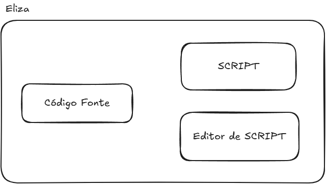

# Eliza: O Primeiro Chatbot

## Introdução

o ELIZA foi um dos primeiros programas de processamento de linguagem
natural e foi apresentado em 1966 por Joseph Weizenbaum no MIT
[@Weizenbaum1996].

O conjunto de padrões e respostas predefinidas constitui o que
Weizenbaum chamou de "roteiro" (ou script) de conversa. O mecanismo do
ELIZA separa o motor genérico de processamento (o algoritmo de busca de
palavras-chave e aplicação de regras) dos dados do script em si. Isso
significa que ELIZA podia em teoria simular diferentes personalidades ou
tópicos apenas carregando um script diferente, sem alterar o código do
programa (veja na Figura [2.1](#fig:elizaeditor){reference-type="ref"
reference="fig:elizaeditor"}). Também foi codificado um editor de texto
para as alterações do próprio Script.

<figure id="fig:elizaeditor">

 

<figcaption>ELIZA: separação entre o código fonte, o script e o editor
de texto.</figcaption>
</figure>

Um destes scripts (o DOCTOR) o deixou famoso. Com este script carregado,
o ELIZA simulava precariamente um psicoterapeuta (do estilo Rogeriano),
refletindo as palavras do usuário de volta em forma de pergunta. A
primeira linha do script é a introdução do chatbot, a primeira palavra
que ele escrever para o usuário. START é um comando técnico do script,
serve para indicar que a seguir virão as regras. REMEMBER 5 estabelece
que a prioridade da palavra REMEMBER é 5, ou seja, se o usuário disser
algo que contenha a palavra REMEMBER, o ELIZA irá responder com uma das
perguntas definidas entre parênteses. A seguir estão as regras de
transformação de frases (decomposition rule e reassembly rule)
associadas à palavra-chave REMEMBER. O exemplo abaixo mostra um trecho
do script DOCTOR:

            
        (REMEMBER 5 
            (
                (0 YOU REMEMBER 0) 
                (DO YOU OFTEN THINK OF 4) 
                (DOES THINKING OF ~ BRING ANYTHING ELSE TO MINO) 
                (WHAT ELSE OO YOU REMEMBER)
                (WHY DO YOU REMEMBER 4 JUST NOW) 
                (WHAT IN THE PRESENT SITUATION REMINDS YOU OF 4) 
                (WHAT IS THE CONNECTION BETWEEN ME AND 4)
            ) 
            (
                (0 DO I REMEMBER 0) 
                (DID YOU THINK I WOULD FORGET 5) 
                (WHY DO YOU THINK I SHOULD RECALL 5 NOW) 
                (WHAT ABOUT 5) 
                (=WHAT) 
                (YOU MENTIONED S)
            ) 
        ) 
        
        (IF 3 
            (
                (0 IF 0) 
                (DO YOU THINK ITS LIKELY THAT 3) 
                (DO YOU WISH THAT 3) 
                (WHAT DO YOU THINK ABOUT 3) 
                (REALLY, 2 3)
            )
        ) 
        

A seguir é apresentado um exemplo de diálogo (retirado do artigo
original) entre um usuário humano e ELIZA, mostrando as respostas em
letras maiúsculas. Nesse exemplo, o usuário faz afirmações pessoais
("Men are all alike.", "Well, my boyfriend made me come here.") e ELIZA
responde com perguntas ou reformulações ("IN WHAT WAY", "YOUR BOYFRIEND
MADE YOU COME HERE?"), reutilizando termos do próprio usuário. Esse
estilo reflexivo encoraja o usuário a continuar falando sem fornecer
respostas diretas.

        Men are all alike. 
        IN WHAT WAY 
        They're always bugging us about something or other. 
        CAN YOU THINK OF A SPECIFIC EXAMPLE 
        Well, my boyfriend made me come here. 
        YOUR BOYFRIEND MADE YOU COME HERE 
        He says I'm depressed much of the time. 
        I AM SORRY TO HEAR YOU ARE DEPRESSED 
        It's true. I am unhappy. 
        DO YOU THINK COMING HERE WILL HELP YOU NOT TO BE UNHAPPY 
        I need some help, that much seems certain. 
        WHAT WOULD IT MEAN TO YOU IF YOU GOT SOME HELP 
        Perhaps I could learn to get along with my mother. 
        TELL ME MORE ABOUT YOUR FAMILY 
        My mother takes care of me. 
        WHO ELSE IN YOUR FAMILY TAKES CARE OF YOU 
        My father. 
        YOUR FATHER 
        You are like my father in some ways. 
        WHAT RESEMBLANCE DO YOU SEE 
        You are not very aggressive but I think you don't want me to 
        notice that. 
        WHAT MAKES YOU THINK I AM NOT VERY AGGRESSIVE 
        You don't argue with me. 
        WHY DO YOU THINK I DON'T ARGUE WITH YOU 
        You are afraid of me. 
        DOES IT PLEASE YOU TO BELIEVE I AM AFRAID OF YOU 
        My father is afraid of everybody. 
        WHAT ELSE COMES TO MIND WHEN YOU THINK OF YOUR FATHER 
        Bullies. 
        DOES THAT HAVE ANYTHING TO DO WITH THE FACT THAT YOUR BOYFRIEND MADE YOU COME HERE 

## Processamento de Entradas e Palavras-Chave

O funcionamento do ELIZA baseia-se em correspondência de padrões por
palavras-chave. Técnica também chamado casamento de padrão, em inglês
*pattner matching* seu paradigma também se encaixa na técnica baseado em
regras (ou *rule-based*). A cada turno, o texto de entrada do usuário é
analisado em busca de palavras-chave predefinidas. O ELIZA fazia uma
varredura da sentença da esquerda para a direita, identificando se
alguma palavra correspondia a uma palavrachave do script. Caso
encontrasse, ELIZA selecionava a palavra-chave mais "importante" (havia
um peso de prioridade associado a cada palavra-chave) e ignorava o
restante da entrada.

Por exemplo, o script DOCTOR, definia palavras-chave como "ALIKE" ou
"SAME" com alta prioridade; assim, na frase "Men are all alike." o
programa detectava a palavra "ALIKE" e disparava uma resposta associada
a ela (no caso: "In what way?"). Se múltiplas palavras-chave
aparecessem, ELIZA escolhia aquela de maior peso para formular a
resposta.

Primeiro o texto de entrada digitado pelo usuário era separado em
palavras, em um técnica que hoje chamamos de tokenização de palavras. A
palavra-chave era identificada, comparando-a sequencialmente até o fim
das palavras existentes, ou até ser encontrado uma pontuação. Caso fosse
encontrado uma pontuação (ponto final ou vírgula), o texto após a
pontuação era ignorado se já tivesse sido identificado uma
palavra-chave. Assim cada processamento da resposta foca em apenas uma
única afirmação (ou frase) do usuário. Se várias palavras-chave fossem
encontradas antes da pontuação, a de maior peso era selecionada.

Por exemplo, o usuário entra com o texto: "I am sick. but, today is
raining". Se houvesse uma palavra-chave no script rankeando a palavra
"SICK\" com alta prioridade, a entrada processada seria somente "I am
sick", o restante depois da pontuação (neste caso, o ponto) seria
gnorado pelo programa.

Se nenhuma palavra-chave fosse encontrada na entrada, ELIZA recorria a
frases genéricas programadas, chamadas de respostas vazias ou sem
conteúdo. Nesses casos, o chatbot emitia mensagens do tipo "I see." ou
"Please, go on." . Esse mecanismo evitava silêncio quando o usuário
dizia algo fora do escopo do script.

Além disso, a implementação original incluía uma estrutura de memória:
algumas declarações recentes do usuário eram armazenadas e, se uma
entrada subsequente não contivesse novas keywords, ELIZA poderia
recuperar um tópico anterior e introduzi-lo na conversa. Por exemplo, se
o usuário mencionasse família em um momento e depois fizesse uma
afirmação vaga, o programa poderia responder retomando o assunto da
família ("DOES THAT HAVE ANYTHING TO DO WITH YOUR FAMILY?"). Essa
estratégia dava uma pseudo-continuidade ao diálogo, simulando que o
sistema "lembrava" de informações fornecidas anteriormente.

## Regras de Transformação de Frases

Encontrada a palavra-chave, ELIZA aplicava uma regra de transformação
associada a ela para gerar a resposta. As regras são definidas em pares:
um padrão de análise (decomposition rule) e um modelo de reconstrução de
frase (reassembly rule).

Primeiro, a frase do usuário é decomposta conforme um padrão que
identifica a contexto mínimo em torno da palavra-chave. Essa
decomposição frequentemente envolve separar a frase em partes e
reconhecer pronomes ou estruturas gramaticais relevantes. Por exemplo,
considere a entrada "You are very helpful.". Uma regra de decomposição
pode identificar a estrutura "You are X" --- onde "X" representa o
restante da frase --- e extrair o complemento "very helpful" como um
componente separado.

Em seguida, a regra de reassembly correspondente é aplicada, remontando
uma sentença de resposta em que "X" é inserido em um template
pré-definido. No exemplo dado, o template de resposta poderia ser "What
makes you think I am X?"; ao inserir X = "very helpful", gera-se "What
makes you think I am very helpful?". Observe que há uma inversão de
pessoa: o pronome "you" do usuário foi trocado por "I" na resposta do
bot.

De fato, uma parte importante das transformações do ELIZA envolve
substituir pronomes (eu/você, meu/seu) para que a resposta faça sentido
como uma frase do ponto de vista do computador falando com o usuário.
Esse algoritmo de substituição é relativamente simples (por exemplo,
"meu" → "seu", "eu" → "você", etc.), mas essencial para dar a impressão
de entendimento gramatical.

## Implementação Original e Variações Modernas

A implementação original de ELIZA foi feita em uma linguagem chamada
MAD-SLIP (um dialecto de Lisp) rodando em um mainframe IBM 7094 no
sistema CTSS do MIT. O código fonte do programa principal continha o
mecanismo de correspondência, enquanto as regras de conversação (script
DOCTOR) eram fornecidas separadamente em formato de listas associativas,
similar a uma lista em Lisp. Infelizmente, Weizenbaum não publicou o
código completo no artigo de 1966 (o que era comum na época), mas
décadas depois o código em MAD-SLIP foi recuperado nos arquivos do MIT,
comprovando os detalhes de implementação [@Lane2025]. De qualquer forma,
a arquitetura descrita no artigo influenciou inúmeras reimplementações
acadêmicas e didáticas nos anos seguintes.

Diversos entusiastas e pesquisadores reescreveram ELIZA em outras
linguagens de programação, dada a simplicidade relativa de seu
algoritmo. Ao longo dos anos surgiram versões em Lisp, PL/I, BASIC,
Pascal, Prolog, Java, Python, OZ, JavaScript, entre muitas outras. Cada
versão normalmente incluía o mesmo conjunto de regras do script
terapeuta ou pequenas variações.

As ideias de ELIZA também inspiraram chatbots mais avançados. Poucos
anos depois, em 1972, surgiu PARRY, escrito pelo psiquiatra Kenneth
Colby, que simulava um paciente paranoico. PARRY tinha um modelo interno
de estado emocional e atitudes, mas na camada de linguagem ainda usava
muitas respostas baseadas em regras, chegando a "conversar" com o
próprio ELIZA em experimentos da época.

Em 1995, Richard Wallace desenvolveu o chatbot ALICE (Artificial
Linguistic Internet Computer Entity), que levava o paradigma de ELIZA a
uma escala muito maior. ALICE utilizava um formato XML chamado AIML
(Artificial Intelligence Markup Language) para definir milhares de
categorias de padrões e respostas. Com mais de 16.000 templates mapeando
entradas para saídas [@Wallace2000], ALICE conseguia manter diálogos bem
mais naturais e abrangentes que o ELIZA original, embora o princípio
básico de correspondência de padrões permanecesse. Esse avanço rendeu a
ALICE três vitórias no Prêmio Loebner (competição de chatbots) no início
dos anos 2000 [@Wallace2000].

Outras variações e sucessores notáveis incluem Jabberwacky (1988) -- que
já aprendia novas frases -- e uma profusão de assistentes virtuais e
bots de domínio específico nas décadas seguintes [@Wallace2000]. Em
suma, o legado de ELIZA perdurou por meio de inúmeros chatbots baseados
em regras, até a transição para abordagens estatísticas e de aprendizado
de máquina no final do século XX.

## Comparação com Modelos de Linguagem Modernos

A técnica de ELIZA, baseada em palavras-chave com respostas
predefinidas, contrasta fortemente com os métodos de Large Language
Models (LLMs) atuais, como o GPT-4, que utilizam redes neurais de
milhões (ou trilhões) de parâmetros e mecanismos de atenção.

### Mecanismo de Pesos: Palavras-Chave vs. Atenção Neural

No ELIZA, a "importância" de uma palavra era determinada manualmente
pelo programador através de pesos ou rankings atribuídos a certas
palavras-chave no script. Ou seja, o programa não aprendia quais termos
focar -- ele seguia uma lista fixa de gatilhos. Por exemplo, termos como
"sempre" ou "igual" tinham prioridade alta no script DOCTOR para
garantir respostas apropriadas.

Em contraste, modelos modernos como o GPT não possuem uma lista fixa de
palavras importantes; em vez disso, eles utilizam o mecanismo de
self-attention para calcular dinamicamente pesos entre todas as palavras
da entrada conforme o contexto [@Vaswani2017].

Na arquitetura Transformer, cada palavra (token) de entrada gera
consultas e chaves que interagem com todas as outras, permitindo ao
modelo atribuir pesos maiores às palavras mais relevantes daquela frase
ou parágrafo [@Vaswani2017]. Em outras palavras, o modelo aprende
sozinho quais termos ou sequências devem receber mais atenção para
produzir a próxima palavra na resposta. Esse mecanismo de atenção
captura dependências de longo alcance e nuances contextuais que um
sistema de palavras-chave fixas como o ELIZA não consegue representar.

Além disso, o "vocabulário" efetivo de um LLM é imenso -- um moddelo GPT
pode ser treinado com trilhões de palavras e ter ajustado seus
parâmetros para modelar estatisticamente a linguagem humana
[@Vaswani2017]. Como resultado, pode-se dizer metaforicamente que os
LLMs têm uma lista de "palavras-chave" milhões de vezes maior (na
prática, distribuída em vetores contínuos) e um método bem mais
sofisticado de calcular respostas do que o ELIZA.

Enquanto ELIZA dependia de coincidências exatas de termos para disparar
regras, modelos como GPT avaliam similaridades semânticas e contexto
histórico graças às representações densas (embeddings) aprendidas
durante o treinamento de rede neural.

### Contextualização e Geração de Linguagem

Devido à sua abordagem baseada em regras locais, o ELIZA tinha
capacidade de contextualização muito limitada. Cada input do usuário era
tratado quase isoladamente: o programa não construía uma representação
acumulada da conversa, além de artifícios simples como repetir algo
mencionado (a estrutura de memória) ou usar pronomes para manter a
ilusão de continuidade. Se o usuário mudasse de tópico abruptamente, o
ELIZA não "perceberia" -- ele apenas buscaria a próxima palavra-chave
disponível ou recorreria a frases genéricas.

Em contraste, modelos de linguagem modernos levam em conta um longo
histórico de diálogo. Chatbots que usam GPT podem manter um contexto
centenas ou milhares de tokens (palavras ou fragmentos) em sua janela de
atenção, o que significa que eles conseguem referenciar informações
mencionadas vários parágrafos atrás e integrá-las na resposta corrente.
O mecanismo de self-attention, em particular, permite que o modelo
incorpore relações contextuais complexas: cada palavra gerada pode
considerar influências de palavras distantes no texto de entrada
[@Vaswani2017].

Por exemplo, ao conversar com um LLM, se você mencionar no início da
conversa que tem um irmão chamado Alex e depois perguntar "ele pode me
ajudar com o problema?", o modelo entenderá que "ele" se refere ao Alex
mencionado anteriormente (desde que dentro da janela de contexto). Já o
ELIZA original não teria como fazer essa ligação, a menos que houvesse
uma regra explícita para "ele" e algum armazenamento específico do nome
-- algo impraticável de antecipar via regras fixas para todos os casos.

Outra diferença crucial está na geração de linguagem. O ELIZA não gera
texto original no sentido pleno: suas respostas são em grande parte
frases prontas (ou templates fixos) embaralhadas com partes da fala do
usuário. Assim, seu vocabulário e estilo são limitados pelo script
escrito manualmente. Modelos GPT, por sua vez, geram respostas novas
combinando probabilisticamente o conhecimento adquirido de um extenso
corpus. Eles não se restringem a repetir trechos da entrada, podendo
elaborar explicações, fazer analogias, criar perguntas inéditas -- tudo
coerente com os exemplos linguísticos em sua base de treinamento.
Enquanto ELIZA tendia a responder com perguntas genéricas ou devolvendo
as palavras do usuário, os LLMs podem produzir respostas informativas e
detalhadas sobre o assunto (pois "aprenderam" uma ampla gama de tópicos
durante o treinamento). Por exemplo, se perguntarmos algo factual ou
complexo, o ELIZA falharia por não ter nenhuma regra a respeito,
provavelmente dando uma resposta vazia. Já um modelo como GPT-4 tentará
formular uma resposta baseada em padrões linguísticos aprendidos e em
conhecimento implícito dos dados, muitas vezes fornecendo detalhes
relevantes.

Em termos de fluência e variedade, os modelos modernos superam o ELIZA
amplamente. O ELIZA frequentemente se repetia ou caía em loops verbais
quando confrontado com inputs fora do roteiro -- um limite claro de
sistemas por regras estáticas. Os LLMs produzem linguagem muito mais
natural e adaptável, a ponto de muitas vezes enganarem os usuários sobre
estarem conversando com uma máquina (um efeito buscado desde o Teste de
Turing). Ironicamente, ELIZA nos anos 60 já provocou um precursor desse
fenômeno -- o chamado Efeito ELIZA, em que pessoas atribuem compreensão
ou sentimentos a respostas de computador que, na verdade, são
superficiais. Hoje, em chatbots GPT, esse efeito se intensifica pela
qualidade das respostas, mas a distinção fundamental permanece: ELIZA
seguia scripts sem compreender, enquanto LLMs inferem padrões e
significados de forma estatística, sem entendimento consciente, mas
atingindo resultados que simulam compreensão de maneira muito mais
convincente.

Em resumo, os avanços de arquitetura (especialmente o mecanismo de
atenção) ampliaram drasticamente a capacidade de contextualização e
geração dos chatbots modernos, marcando uma evolução significativa desde
o mecanismo simples porém pioneiro de ELIZA.
