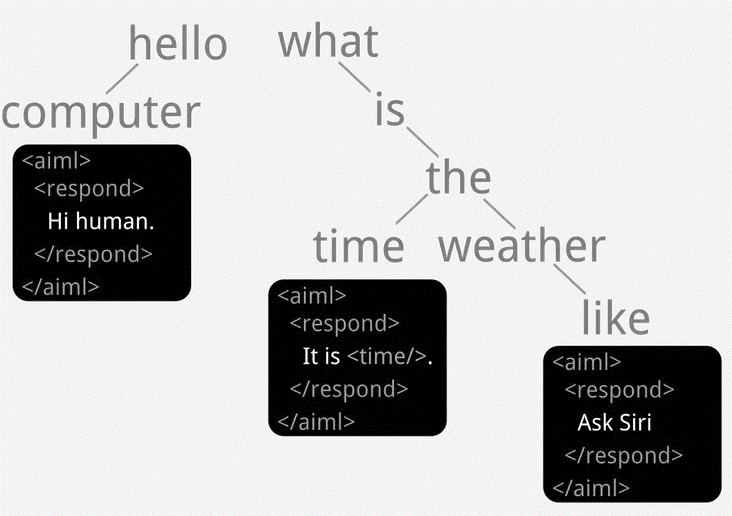

# Artificial Intelligence Markup Language

## Introdução

O Artificial Intelligence Markup Language (AIML) é uma especificação
baseada em XML, proposta por [@Wallace2009], destinada à programação de
agentes conversacionais, comumente denominados chatbots. A concepção da
linguagem prioriza o minimalismo, característica que simplifica o
processo de criação de bases de conhecimento por indivíduos sem
experiência prévia em programação [@Wallace2009]. A arquitetura
fundamental de um interpretador AIML genérico é ilustrada na
Figura [3.1](#fig:interpretador){reference-type="ref"
reference="fig:interpretador"}.

<figure id="fig:interpretador">

 

Adaptado de 

<figcaption>Interpretador AIML arquitetura.</figcaption>
</figure>

A técnica central empregada pelo AIML é a correspondência de padrões
(*pattern matching*). Este método é amplamente utilizado no
desenvolvimento de chatbots, particularmente em sistemas orientados a
perguntas e respostas [@Abdul-Kader2015]. Uma das metas de projeto do
AIML é possibilitar a fusão de bases de conhecimento de múltiplos
chatbots especializados em domínios distintos. Teoricamente, um
interpretador poderia agregar essas bases, eliminando automaticamente
categorias redundantes para formar um *chatbot* mais abrangente
[@Wallace2000].

AIML é frequentemente associado aos chatbots de terceira geração
[@Maria2010] e estima-se sua adoção em mais de 50.000 implementações em
diversos idiomas. Extensões da linguagem foram propostas, como o iAIML,
que introduziu novas *tags* e incorporou o conceito de intenção com base
nos princípios da Teoria da Análise da Conversação (TAC) [@Neves2005].
Adicionalmente, ferramentas baseadas na Web foram desenvolvidas para
apoiar a construção de bases de conhecimento AIML [@Krassmann2017]. Um
exemplo proeminente é o *chatbot* ALICE, cuja implementação em AIML
compreendia aproximadamente 16.000 categorias, cada uma potencialmente
contendo múltiplas *tags* XML aninhadas [@Wallace2000]. Uma
representação visual desta estrutura de conhecimento é apresentada na
Figura [3.2](#fig:representacaovisual){reference-type="ref"
reference="fig:representacaovisual"}.

<figure id="fig:representacaovisual">

 

Retirado de 

<figcaption>Representação visual da base de conhecimento do chatbot
ALICE.</figcaption>
</figure>

[@Wallace2000] estabeleceu analogias entre o funcionamento de
interpretadores AIML e a teoria do Raciocínio Baseado em Casos (RBC).
Nessa perspectiva, as categorias AIML funcionam como \"casos\", onde o
algoritmo identifica o padrão que melhor se alinha à entrada do usuário.
Cada categoria estabelece um vínculo direto entre um padrão de estímulo
e um modelo de resposta. Consequentemente, chatbots AIML inserem-se na
tradição da robótica minimalista, reativa ou de estímulo-resposta
[@Wallace2000], conforme esquematizado na
Figura [3.3](#fig:teoriaestimulo){reference-type="ref"
reference="fig:teoriaestimulo"}. Vale notar que a própria técnica de RBC
já foi integrada a interpretadores AIML como um mecanismo para consultar
fontes de dados externas e expandir a base de conhecimento do agente
[@Kraus2008].

<figure id="fig:teoriaestimulo">

 

Retirado de 

<figcaption>Teoria estímulo-resposta aplicada no AIML</figcaption>
</figure>

Os chatbots que utilizam AIML são classificados como sistemas \"baseados
em recuperação\" (retrieval-based). Tais modelos operam a partir de um
repositório de respostas predefinidas, selecionando a mais apropriada
com base na entrada do usuário e no contexto conversacional, guiando
assim o fluxo da interação. Esta abordagem é frequentemente empregada na
construção de chatbots destinados a operar em domínios de conhecimento
restritos [@Borah2019].

A Figura [3.4](#fig:exemplodeumabase){reference-type="ref"
reference="fig:exemplodeumabase"} demonstra a estrutura elementar de um
arquivo AIML. A *tag* `<category>` encapsula a unidade básica de
conhecimento. Internamente, a *tag* `<pattern>` define o padrão de
entrada a ser reconhecido (no exemplo, o caractere curinga `*`, que
corresponde a qualquer entrada), enquanto a *tag* `<template>` contém a
resposta associada. No exemplo ilustrado, o *chatbot* responderia
\"Hello!\" a qualquer interação. Uma visão abstrata da árvore de
conhecimento resultante pode ser observada na
Figura [3.5](#fig:representacaovisualabstrata){reference-type="ref"
reference="fig:representacaovisualabstrata"}. O AIML padrão suporta
transições baseadas primariamente em correspondência de padrões, uma
limitação inerente, embora extensões específicas de interpretadores
possam permitir a integração de outras técnicas de processamento.

<figure id="fig:exemplodeumabase">
<pre><code>        &lt;aiml&gt;
        &lt;category&gt;
            &lt;pattern&gt;*&lt;/pattern&gt;
            &lt;template&gt;Hello!&lt;/template&gt;
        &lt;/category&gt;
        &lt;/aiml</code></pre>

Retirado de 

<figcaption>Exemplo de uma base de conhecimento em AIML</figcaption>
</figure>

<figure id="fig:representacaovisualabstrata">

 

Retirado de <a
href="https://www.pandorabots.com/docs/aiml-fundamentals/"
class="uri">https://www.pandorabots.com/docs/aiml-fundamentals/</a>

<figcaption>Representação visual abstrata de uma base de conhecimento
AIML</figcaption>
</figure>

O profissional responsável pela criação, manutenção e curadoria da base
de conhecimento de um *chatbot* AIML é denominado *botmaster*
[@Wallace2000]. Suas atribuições englobam a edição da base
(frequentemente via ferramentas auxiliares), a análise de logs de
diálogo para identificar padrões de interação e a subsequente criação ou
refino de respostas. Este papel pode ser exercido por indivíduos com
diferentes perfis, incluindo *webmasters*, desenvolvedores, redatores,
engenheiros ou outros interessados na construção de chatbots
[@Wallace2000].

Algumas implementações de interpretadores AIML podem incorporar
capacidades rudimentares de compreensão semântica através do *Resource
Description Framework* (RDF)[^1]. O RDF é um padrão W3C para
representação de informações na Web, usualmente por meio de triplas
(sujeito-predicado-objeto) que descrevem relações entre entidades. No
contexto AIML, RDF pode ser utilizado para armazenar e consultar fatos.
Contudo, mesmo com tais adições, as capacidades linguísticas permanecem
aquém da complexidade e do potencial gerativo da linguagem humana,
conforme descrito por [@chomsky2002syntactic].

Embora [@Hohn2019] argumente que o AIML padrão carece de um conceito
explícito de \"intenção\" (*intent*), similar ao encontrado em
plataformas de *Natural Language Understanding* (NLU), é possível emular
o reconhecimento de intenções. Isso é tipicamente alcançado definindo
categorias que representam \"formas canônicas\" ou \"padrões atômicos\"
para uma intenção específica[^2]. Variações de entrada (e.g., \"oi\",
\"olá\") podem ser mapeadas para uma categoria canônica (e.g.,
\"saudação\") usando a *tag* `<srai>` (*Symbolic Reduction Artificial
Intelligence*), que redireciona o fluxo de processamento (ver
Figura [3.6](#fig:sodatagsrai){reference-type="ref"
reference="fig:sodatagsrai"}). Dessa forma, um *chatbot* AIML pode
gerenciar intenções distintas dentro de seu domínio, como realizar um
pedido ou verificar o status de entrega.

<figure id="fig:sodatagsrai">

 

Retirado de 

<figcaption>Uso da tag <code>&lt;srai&gt;</code></figcaption>
</figure>

chatbots baseados em AIML têm obtido sucesso significativo em
competições como o Prêmio Loebner. Notavelmente, o *chatbot*
Mitsuku[^3], desenvolvido por Steve Worswick, conquistou múltiplos
títulos recentes[^4], seguindo vitórias anteriores do ALICE.
[@Wallace2000].

Adicionalmente, Mitsuku foi classificado em primeiro lugar numa análise
comparativa envolvendo oito chatbots [@Sharma2020]. Nesse estudo, que
avaliou atributos conversacionais com base em um conjunto padronizado de
perguntas, o Google Assistant obteve a segunda posição, seguido pela
Siri em terceiro. O *chatbot* ALICE. alcançou a quarta posição, enquanto
o ELIZA ficou na última colocação entre os sistemas comparados
[@Sharma2020].

## Tags do AIML 1.0: Explicação e Exemplos

Esta seção descreve as principais tags do AIML, versão 1.0, com
explicações e exemplos.

##### `<aiml>`

**Descrição:** Tag raiz que engloba todo o conteúdo AIML.

        <aiml version="1.0">
            <!-- Categorias aqui -->
        </aiml>

##### `<category>`

**Descrição:** Unidade básica de conhecimento, contendo um padrão e uma
resposta.

        <category>
            <pattern>OLÁ</pattern>
            <template>Oi! Como posso ajudar você hoje?</template>
        </category>

##### `<pattern>`

**Descrição:** Define o padrão de entrada do usuário, com curingas como
`*` e `_`.

        <category>
            <pattern>EU GOSTO DE *</pattern>
            <template>Que bom que você gosta de <star/>!</template>
        </category>

##### `<template>`

**Descrição:** Define a resposta do bot ao padrão correspondente.

        <category>
            <pattern>QUAL É O SEU NOME</pattern>
            <template>Meu nome é neo chatbot.</template>
        </category> 

##### `<star/>`

**Descrição:** Captura o conteúdo do curinga `*` ou `_`.

        <category>
            <pattern>MEU NOME É *</pattern>
            <template>Olá, <star/>!</template>
        </category>

##### `<that>`

**Descrição:** Considera a última resposta do bot para decidir a
próxima.

    <category>
        <pattern>SIM</pattern>
        <that>Você gosta de programar?</that>
        <template>Ótimo! Qual linguagem você prefere?</template>
    </category>

##### `<topic>`

**Descrição:** Define um contexto ou tópico para categorias.

    <category>
      <pattern>VAMOS FALAR SOBRE ESPORTE</pattern>
      <template>Ok! <topic name="esporte"/></template>
    </category>

##### `<random>` e `<li>`

**Descrição:** Escolhe aleatoriamente uma resposta de uma lista.

    <category>
      <pattern>COMO ESTÁ O TEMPO</pattern>
      <template>
        <random>
          <li>Está ensolarado!</li>
          <li>Está chovendo.</li>
        </random>
      </template>
    </category>

##### `<condition>`

**Descrição:** Adiciona lógica condicional baseada em variáveis.

    <category>
      <pattern>COMO EU ESTOU</pattern>
      <template>
        <condition name="humor">
          <li value="feliz">Você está bem!</li>
          <li>Não sei ainda!</li>
        </condition>
      </template>
    </category>

##### `<set>` e `<get>`

**Descrição:** Define e recupera variáveis.

        <category>
            <pattern>MEU NOME É *</pattern>
            <template><set name="nome"><star/></set>Olá, <get name="nome"/>!</template>
        </category>

##### `<srai>`

**Descrição:** Redireciona a entrada para outro padrão.

        <category>
            <pattern>OI</pattern>
            <template><srai>OLÁ</srai></template>
        </category>

##### `<think>`

**Descrição:** Executa ações sem exibir o conteúdo.

        <category>
            <pattern>EU SOU TRISTE</pattern>
            <template><think><set name="humor">triste</set></think>Sinto muito!</template>
        </category>

##### `<person>`, `<person2>`, `<gender>`

**Descrição:** Transforma pronomes ou ajusta gênero.

        <category>
            <pattern>EU TE AMO</pattern>
            <template><person><star/></person> ama você também!</template>
        </category>

##### `<formal>`, `<uppercase>`, `<lowercase>`

**Descrição:** Formata texto (capitaliza, maiúsculas, minúsculas).

    <category>
      <pattern>MEU NOME É joão</pattern>
      <template>Olá, <formal><star/></formal>!</template>
    </category>

##### `<sentence>`

**Descrição:** Formata como frase (primeira letra maiúscula, ponto
final).

    <category>
      <pattern>oi</pattern>
      <template><sentence><star/></sentence></template>
    </category>
