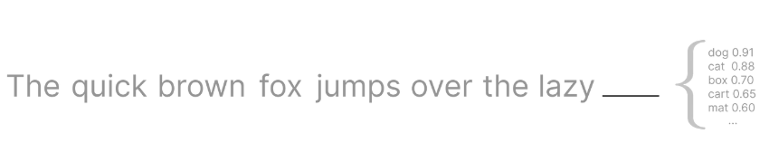
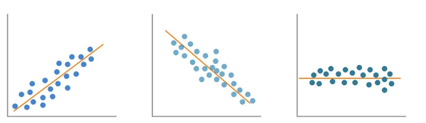
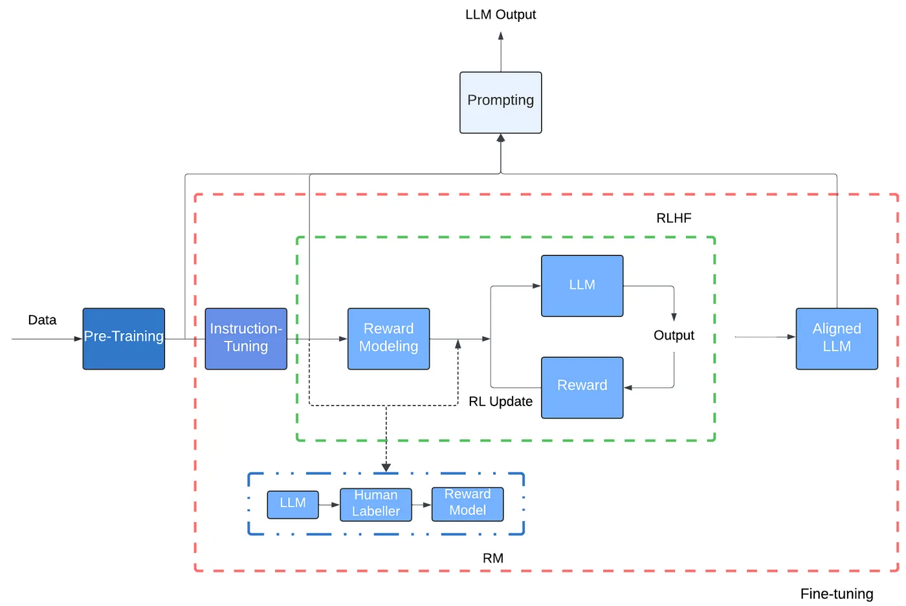
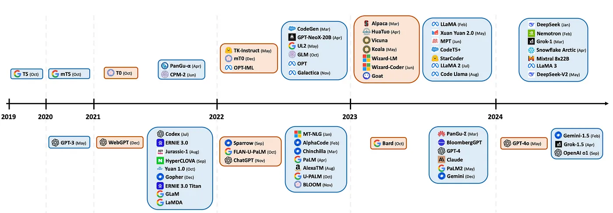

# Large Language Models: A Short Introduction

## sobre

Este é uma tradução para portugues brasileiro, com alguns ajustes e remoção de algumas partes, da postagem publicada no [medium](https://towardsdatascience.com/large-language-models-a-short-introduction-bb8366118ad0) de autoria de Carolina Bento com o título "Large Language Models: A Short Introduction".

Neste artigo, daremos uma breve olhada no que são LLMs, por que eles são uma tecnologia extremamente interessante, por que eles são importantes.

Observação: neste artigo, usaremos Large Language Model, LLM e modelo de forma intercambiável.

## O que é um LLM

Um [modelo de linguagem grande](https://en.wikipedia.org/wiki/Large_language_model), normalmente chamado de LLM, é um modelo matemático que gera texto, como preencher a lacuna para a próxima palavra em uma frase.

<iframe width="100%" height="522" src="https://www.youtube.com/embed/LPZh9BOjkQs" title="Large Language Models explained briefly" frameborder="0" allow="accelerometer; autoplay; clipboard-write; encrypted-media; gyroscope; picture-in-picture; web-share" referrerpolicy="strict-origin-when-cross-origin" allowfullscreen></iframe>

Por exemplo, quando você o alimenta com a frase 

```
The quick brown fox jumps over the lazy ____ , 
```
ele não sabe exatamente que a próxima palavra é ```dog```. O que o modelo produz em vez disso é uma lista de possíveis próximas palavras com suas probabilidades correspondentes de virem a seguir em uma frase que começa com essas palavras exatas.



<center><small>Exemplo de previsão da próxima palavra em uma frase. <a href="https://towardsdatascience.com/large-language-models-a-short-introduction-bb8366118ad0)">Fonte da Imagem</a>.</small></center>

A razão pela qual os LLMs são tão bons em prever a próxima palavra em uma frase é porque eles são treinados com uma quantidade incrivelmente grande de texto, que normalmente é raspado da Internet. 

Por outro lado, se você estiver construindo um LLM que seja específico para um domínio em particular, por exemplo, você está construindo um chatbot que poderia conversar com você como se fosse um personagem nas peças de Shakespeare , a internet certamente terá muitos trechos ou até mesmo suas obras completas, mas terá uma tonelada de outros textos que não são relevantes para a tarefa em questão. Neste caso, você alimentaria o LLM no contexto de Shakespeare apenas do chatbot, ou seja, todas as suas peças e sonetos.

Embora os LLMs sejam treinados com uma quantidade gigantesca de dados, não é isso que o Large in Large Language Models representa. Além do tamanho dos dados de treinamento, a outra grande quantidade nesses modelos é o número de parâmetros que eles têm, cada um com a possibilidade de ser ajustado, ou seja, sintonizado.

O modelo estatístico mais simples é a Regressão Linear Simples , com apenas dois parâmetros, a inclinação e a interceptação. E mesmo com apenas dois parâmetros, há algumas formas diferentes que a saída do modelo pode assumir.



<center><small>Diferentes formas de uma regressão linear. <a href="https://towardsdatascience.com/large-language-models-a-short-introduction-bb8366118ad0)">Fonte da Imagem</a>.</small></center>

Como comparação, quando o GPT-3 foi lançado em 2020, ele tinha 175B parâmetros, sim, bilhões![3] Enquanto o LLaMa, o LLM de código aberto do Meta, tinha vários modelos diferentes variando de 7B a 65B parâmetros quando foi lançado em 2023 .

Todos esses bilhões de parâmetros começam com valores aleatórios, no início do processo de treinamento, e é durante a parte de retropropagação da fase de treinamento que eles são continuamente ajustados e modificados.

Semelhante a qualquer outro modelo de Machine Learning, durante a fase de treinamento, a saída do modelo é comparada com o valor real esperado para a saída, a fim de calcular o erro. Quando ainda há espaço para melhorias, a Backpropagation garante que os parâmetros do modelo sejam ajustados de forma que o modelo possa prever valores com um pouco menos de erro na próxima vez.

Mas isso é apenas o que chamamos de pré-treinamento , onde o modelo se torna proficiente em prever a próxima palavra em uma frase.

Para que o modelo tenha interações realmente boas com um humano, a ponto de você — o humano — poder fazer uma pergunta ao chatbot e sua resposta parecer estruturalmente precisa, o LLM subjacente tem que passar por uma etapa de Aprendizado por Reforço com Feedback Humano . Este é literalmente o humano no loop que é frequentemente falado no contexto de modelos de Aprendizado de Máquina.

Nessa fase, os humanos marcam as previsões que não são tão boas e, ao receber esse feedback, os parâmetros do modelo são atualizados e o modelo é treinado novamente, quantas vezes forem necessárias, para atingir o nível de qualidade de previsão desejado.

Está claro agora que esses modelos são extremamente complexos e precisam ser capazes de executar milhões, se não bilhões de cálculos. Essa computação de alta intensidade exigiu novas arquiteturas, no nível do modelo com Transformers e para computação, com GPUs .

GPU é essa classe de processadores gráficos usada em cenários quando você precisa executar um número incrivelmente grande de cálculos em um curto período de tempo, por exemplo, ao renderizar suavemente personagens em um videogame. Comparadas às CPUs tradicionais encontradas em seu laptop ou PC de torre, as GPUs têm a capacidade de executar sem esforço muitos cálculos paralelos.

O avanço para LLMs foi quando pesquisadores perceberam que GPUs também podem ser aplicadas a problemas não gráficos. Tanto Machine Learning quanto Computer Graphics dependem de álgebra linear, executando operações em matrizes, então ambos se beneficiam da capacidade de executar muitas computações paralelas.

Transformers é um novo tipo de arquitetura desenvolvida pelo Google, que faz com que cada operação feita durante o treinamento do modelo possa ser paralelizada. Por exemplo, ao prever a próxima palavra em uma frase, um modelo que usa uma arquitetura Transformer não precisa ler a frase do início ao fim, ele processa o texto inteiro ao mesmo tempo, em paralelo. Ele associa cada palavra processada a uma longa matriz de números que dão significado a essa palavra. Pensando em Álgebra Linear novamente por um segundo, em vez de processar e transformar um ponto de dados por vez, a combinação de Transformers e GPUs pode processar toneladas de pontos ao mesmo tempo, aproveitando matrizes.

Além da computação paralelizada, o que distingue os Transformers é uma operação única chamada Atenção. De uma forma muito simplista, Atenção torna possível olhar todo o contexto em torno de uma palavra, mesmo que ela ocorra várias vezes em frases diferentes como

```
At the end of the show, the singer took a bow multiple times.
```

```
Jack wanted to go to the store to buy a new bow for target practice.
```

Se nos concentrarmos na palavra ```bow```, você pode ver como o contexto em que essa palavra aparece em cada frase e seu significado real são muito diferentes.

A atenção permite que o modelo refine o significado que cada palavra codifica com base no contexto ao redor delas.

Isso, mais alguns passos adicionais como treinar uma Rede Neural Feedforward , tudo feito várias vezes, faz com que o modelo gradualmente refine sua capacidade de codificar as informações corretas. Todos esses passos têm a intenção de tornar o modelo mais preciso e não misturar o significado de  ```bow``` , o movimento e  ```bow``` (objeto relacionado ao arco e flecha) quando ele executa uma tarefa de previsão.

Imagem e legenda retiradas do artigo referenciado em [^2].



<center><small>Um diagrama de fluxo básico representando vários estágios de LLMs do pré-treinamento ao prompt/utilização. Prompts LLMs para gerar respostas são possíveis em diferentes estágios de treinamento como pré-treinamento, ajuste de instrução ou ajuste de alinhamento. “RL” significa aprendizado por reforço, “RM” representa modelagem de recompensa e “RLHF” representa aprendizado por reforço com feedback humano. </small></center>

O desenvolvimento de Transformers e GPUs permitiu que os LLMs explodissem em uso e aplicação em comparação aos modelos de linguagem anteriores que precisavam ler uma palavra por vez. Sabendo que um modelo fica melhor quanto mais dados de qualidade ele aprende, você pode ver como processar uma palavra por vez era um grande gargalo.

## Por que os LLMs são importantes

Com a capacidade descrita, os LLMs podem processar enormes quantidades de exemplos de texto e então prever com alta precisão a próxima palavra em uma frase, combinado com outras estruturas poderosas de Inteligência Artificial, muitas tarefas de linguagem natural e recuperação de informações se tornaram muito mais fáceis de implementar e produtizar .

Em essência, os Grandes Modelos de Linguagem (LLMs) surgiram como sistemas de inteligência artificial de ponta que podem processar e gerar texto com comunicação coerente e generalizar múltiplas tarefas [2].

Pense em tarefas como traduzir do inglês para o espanhol, resumir um conjunto de documentos, identificar certas passagens em documentos ou ter um chatbot respondendo suas perguntas sobre um tópico específico.

Essas tarefas eram possíveis antes, mas o esforço necessário para construir um modelo era incrivelmente maior e a taxa de melhoria desses modelos era muito mais lenta devido a gargalos tecnológicos. Os LLMs chegaram e turbinaram todas essas tarefas e aplicações.

Você provavelmente já interagiu ou viu alguém interagindo diretamente com produtos que usam LLMs em sua essência.

Esses produtos são muito mais do que um simples LLM que prevê com precisão a próxima palavra em uma frase. Eles alavancam LLMs e outras técnicas e estruturas de Machine Learning para entender o que você está perguntando, pesquisar todas as informações contextuais que eles viram até agora e apresentar a você uma resposta humana e, na maioria das vezes, coerente. Ou pelo menos alguns fornecem orientação sobre o que procurar em seguida.

Existem vários produtos de Inteligência Artificial (IA) que alavancam LLMs, desde o Meta AI do Facebook , o Gemini do Google, o ChatGPT da Open AI , que toma emprestado seu nome da tecnologia Generative Pre-trained Transformer, o CoPilot da Microsoft , entre muitos, muitos outros, abrangendo uma ampla gama de tarefas para ajudar você.

## Conclusão

Os LMMs são, sem dúvida, uma área de pesquisa emergente que vem evoluindo em um ritmo extremamente rápido, como você pode ver na linha do tempo abaixo.

Imagem e legenda retiradas do artigo referenciado em [^1]



<center><small>Exibição cronológica de lançamentos de LLM: cartões azuis representam modelos 'pré-treinados', enquanto cartões laranja correspondem a modelos 'ajustados por instrução'. Os modelos na metade superior significam disponibilidade de código aberto, enquanto aqueles na parte inferior são de código fechado. O gráfico ilustra a tendência crescente em direção a modelos ajustados por instrução e de código aberto, destacando o cenário em evolução e as tendências na pesquisa de processamento de linguagem natural.</small></center>


Estamos apenas nos primeiros dias da produtização, ou aplicação de produtos. Mais e mais empresas estão aplicando LLMs em suas áreas de domínio, a fim de simplificar tarefas que levariam vários anos e uma quantidade incrível de fundos para pesquisar, desenvolver e levar ao mercado.

Quando aplicados de forma ética e consciente do consumidor, os LLMs e produtos que têm LLMs em seu núcleo fornecem uma grande oportunidade para todos. Para pesquisadores, é um campo de ponta com uma riqueza de problemas teóricos e práticos para desembaraçar.

Por exemplo, em Genômica, gLMs ou Modelos de Linguagem Genômica, ou seja, Grandes Modelos de Linguagem treinados em sequências de DNA, são usados ​​para acelerar nossa compreensão geral dos genomas e como o DNA funciona e interage com outras funções[4]. Essas são grandes questões para as quais os cientistas não têm respostas definitivas, mas os LLMs estão provando ser uma ferramenta que pode ajudá-los a progredir em uma escala muito maior e iterar suas descobertas muito mais rápido. Para fazer um progresso constante na ciência, ciclos de feedback rápidos são cruciais.

## Referências

[^1]:Uma visão geral abrangente de grandes modelos de linguagem . 2024. Humza Naveed e Asad Ullah Khan e Shi Qiu e Muhammad Saqib e Saeed Anwar e Muhammad Usman e Naveed Akhtar e Nick Barnes e Ajmal Mian.

[3] Modelos de linguagem são aprendizes de poucas tentativas . 2020. Tom B. Brown e Benjamin Mann e Nick Ryder e Melanie Subbiah e Jared Kaplan e Prafulla Dhariwal e Arvind Neelakantan e Pranav Shyam e Girish Sastry e Amanda Askell e Sandhini Agarwal e Ariel Herbert-Voss e Gretchen Krueger e Tom Henighan e Rewon Child e Aditya Ramesh e Daniel M. Ziegler e Jeffrey Wu e Clemens Winter e Christopher Hesse e Mark Chen e Eric Sigler e Mateusz Litwin e Scott Gray e Benjamin Chess e Jack Clark e Christopher Berner e Sam McCandlish e Alec Radford e Ilya Sutskever e Dario Amodei

[4] Modelos de linguagem genômica: oportunidades e desafios . 2024. Gonzalo Benegas e Chengzhong Ye e Carlos Albors e Jianan Canal Li e Yun S. Song.

[^2]: Bento, Carolina. "Large Language Models: A Short Introduction." Medium, Towards Data Science, 2023.