# A Very Gentle Introduction to Large Language Models without the Hype

## Sobre

Esse artigo é uma tradução para o português do artigo no [medium](https://mark-riedl.medium.com/a-very-gentle-introduction-to-large-language-models-without-the-hype-5f67941fa59e)

[Mais artigos do autor](https://mark-riedl.medium.com/). Um do scratch.

## Introdução

Este artigo foi criado para dar às pessoas sem formação em ciência da computação alguma visão sobre como o ChatGPT e sistemas de IA semelhantes funcionam (GPT-3, GPT-4, Bing Chat, Bard, etc.). O ChatGPT é um chatbot — um tipo de IA conversacional construída — mas em cima de um Large Language Model . Essas são definitivamente palavras e vamos decompô-las. No processo, discutiremos os conceitos principais por trás delas. Este artigo não requer nenhuma formação técnica ou matemática. Faremos uso intenso de metáforas para ilustrar os conceitos. Falaremos sobre por que os conceitos principais funcionam da maneira que funcionam e o que podemos ou não esperar que Large Language Models como o ChatGPT façam.

Aqui está o que faremos. Vamos percorrer gentilmente algumas das terminologias associadas a Large Language Models e ChatGPT sem nenhum jargão. Se eu tiver que usar jargão, vou destrinchar sem jargão. Começaremos bem básico, com "o que é Inteligência Artificial" e trabalharemos nosso caminho para cima. Usarei algumas metáforas recorrentes tanto quanto possível. Falarei sobre as implicações das tecnologias em termos do que devemos esperar que elas façam ou não.

Vamos!

## O que é Inteligência Artificial?

Mas primeiro, vamos começar com alguma terminologia básica que você provavelmente está ouvindo bastante. O que é inteligência artificial ?

Inteligência artificial: Uma entidade que realiza comportamentos que uma pessoa poderia razoavelmente chamar de inteligentes se um humano fizesse algo semelhante.

É um pouco problemático definir inteligência artificial usando a palavra "inteligente", mas ninguém consegue concordar com uma boa definição de "inteligente". No entanto, acho que isso ainda funciona razoavelmente bem. Basicamente diz que se olharmos para algo artificial e ele fizer coisas que sejam envolventes e úteis e pareçam ser um tanto não triviais, então podemos chamá-lo de inteligente. Por exemplo, frequentemente atribuímos o termo "IA" a personagens controlados por computador em jogos de computador. A maioria desses bots são simples pedaços de código if-then-else (por exemplo, "se o jogador estiver dentro do alcance, atire, senão mova-se para a pedra mais próxima para se proteger"). Mas se estamos fazendo o trabalho de nos manter envolvidos e entretidos, e não fazendo coisas obviamente estúpidas, então podemos pensar que eles são mais sofisticados do que são.

Uma vez que conseguimos entender como algo funciona, podemos não ficar muito impressionados e esperar algo mais sofisticado nos bastidores. Tudo depende do que você sabe sobre o que está acontecendo nos bastidores.

O ponto-chave é que a inteligência artificial não é mágica. E porque não é mágica, pode ser explicada.

Então vamos lá.

## O que é aprendizado de máquina?

Outro termo que você ouvirá frequentemente associado à inteligência artificial é aprendizado de máquina .

Aprendizado de máquina : um meio pelo qual é possível criar comportamento ao receber dados, formar um modelo e, então, executar o modelo.
Às vezes é muito difícil criar manualmente um monte de instruções if-then-else para capturar algum fenômeno complicado, como a linguagem. Neste caso, tentamos encontrar um monte de dados e usar algoritmos que podem encontrar padrões nos dados para modelar.

Mas o que é um modelo? Um modelo é uma simplificação de algum fenômeno complexo. Por exemplo, um carro modelo é apenas uma versão menor e mais simples de um carro real que tem muitos dos atributos, mas não se destina a substituir completamente o original. Um carro modelo pode parecer real e ser útil para certos propósitos, mas não podemos levá-lo até a loja.

Uma imagem gerada por DALL-E de um modelo de carro sobre uma mesa.
Assim como podemos fazer uma versão menor e mais simples de um carro, também podemos fazer uma versão menor e mais simples da linguagem humana. Usamos o termo modelos de linguagem grandes porque esses modelos são, bem, grandes, da perspectiva de quanta memória é necessária para usá-los. Os maiores modelos em produção, como ChatGPT, GPT-3 e GPT-4, são grandes o suficiente para exigir supercomputadores massivos em execução em servidores de data center para criar e executar.

## O que é uma rede neural?

Há muitas maneiras de aprender um modelo a partir de dados. A Rede Neural é uma delas. A técnica é baseada aproximadamente em como o cérebro humano é composto por uma rede de células cerebrais interconectadas chamadas neurônios que passam sinais elétricos de um lado para o outro, de alguma forma nos permitindo fazer todas as coisas que fazemos. O conceito básico da rede neural foi inventado na década de 1940 e os conceitos básicos sobre como treiná-las foram inventados na década de 1980. As redes neurais são muito ineficientes, e foi somente por volta de 2017 que o hardware do computador ficou bom o suficiente para usá-las em larga escala.

Mas em vez de cérebros, eu gosto de pensar em redes neurais usando a metáfora de circuitos elétricos. Você não precisa ser um engenheiro elétrico para saber que a eletricidade flui através de fios e que temos coisas chamadas resistores que tornam mais difícil para a eletricidade fluir através de partes de um circuito.

Imagine que você queira fazer um carro autônomo que possa dirigir na rodovia. Você equipou seu carro com sensores de proximidade na frente, atrás e nas laterais. Os sensores de proximidade relatam um valor de 1,0 quando há algo muito próximo e relatam um valor de 0,0 quando nada é detectável por perto.

Você também equipou seu carro para que mecanismos robóticos possam girar o volante, acionar os freios e acionar o acelerador. Quando o acelerador recebe um valor de 1,0, ele usa aceleração máxima, e 0,0 significa nenhuma aceleração. Da mesma forma, um valor de 1,0 enviado ao mecanismo de frenagem significa pisar fundo nos freios e 0,0 significa nenhuma frenagem. O mecanismo de direção assume um valor de -1,0 a +1,0 com um valor negativo significando virar para a esquerda e um valor positivo significando virar para a direita e 0,0 significando manter-se reto.

Você também registrou dados sobre como você dirige. Quando a estrada à sua frente está limpa, você acelera. Quando há um carro na sua frente, você desacelera. Quando um carro se aproxima muito à esquerda, você vira à direita e muda de faixa. A menos, é claro, que haja um carro à sua direita também. É um processo complexo que envolve diferentes combinações de ações (virar para a esquerda, virar para a direita, acelerar mais ou menos, frear) com base em diferentes combinações de informações do sensor.

Agora você tem que conectar o sensor aos mecanismos robóticos. Como você faz isso? Não está claro. Então você conecta cada sensor a cada atuador robótico.

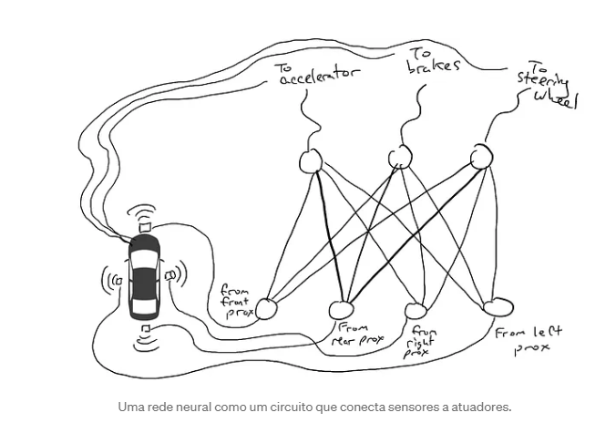

Uma rede neural como um circuito que conecta sensores a atuadores.
O que acontece quando você leva seu carro para a estrada? A corrente elétrica flui de todos os sensores para todos os atuadores robóticos e o carro simultaneamente vira para a esquerda, vira para a direita, acelera e freia. É uma bagunça.

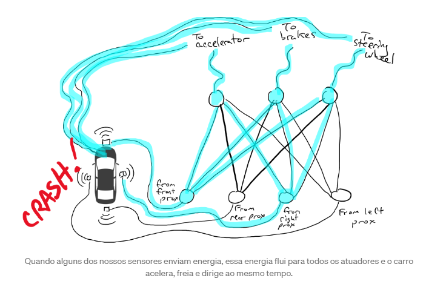

Quando alguns dos nossos sensores enviam energia, essa energia flui para todos os atuadores e o carro acelera, freia e dirige ao mesmo tempo.
Isso não é bom. Então eu pego meus resistores e começo a colocá-los em diferentes partes dos circuitos para que a eletricidade possa fluir mais livremente entre certos sensores e certos atuadores robóticos. Por exemplo, eu quero que a eletricidade flua mais livremente dos sensores de proximidade dianteiros para os freios e não para o volante. Eu também coloco coisas chamadas gates, que interrompem o fluxo de eletricidade até que eletricidade suficiente se acumule para acionar um interruptor (permitir que a eletricidade flua apenas quando o sensor de proximidade dianteiro e o sensor de proximidade traseiro estiverem relatando números altos), ou enviar energia elétrica para frente apenas quando a força elétrica de entrada estiver baixa (enviar mais eletricidade para o acelerador quando o sensor de proximidade dianteiro estiver relatando um valor baixo).

Mas onde coloco esses resistores e gates? Não sei. Começo a colocá-los aleatoriamente em todos os lugares. Então tento novamente. Talvez dessa vez meu carro dirija melhor, o que significa que às vezes ele freia quando os dados dizem que é melhor frear e vira quando os dados dizem que é melhor virar, etc. Mas ele não faz tudo certo. E faz algumas coisas pior (acelera quando os dados dizem que é melhor frear). Então continuo tentando aleatoriamente diferentes combinações de resistores e gates. Eventualmente, vou tropeçar em uma combinação que funciona bem o suficiente para que eu declare sucesso. Talvez pareça com isso:

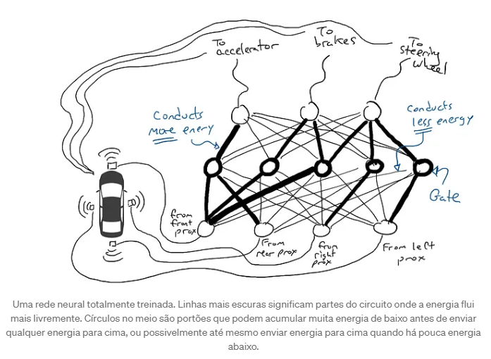

Uma rede neural totalmente treinada. Linhas mais escuras significam partes do circuito onde a energia flui mais livremente. Círculos no meio são portões que podem acumular muita energia de baixo antes de enviar qualquer energia para cima, ou possivelmente até mesmo enviar energia para cima quando há pouca energia abaixo.
(Na realidade, não adicionamos ou subtraímos portas, que estão sempre lá, mas modificamos as portas para que sejam ativadas com menos energia de baixo ou exijam mais energia de baixo, ou talvez liberem muita energia somente quando há muito pouca energia de baixo. Os puristas do aprendizado de máquina podem vomitar um pouco na boca com essa caracterização. Tecnicamente, isso é feito ajustando algo chamado polarização nas portas, que normalmente não é mostrado em diagramas como esses, mas em termos da metáfora do circuito pode ser pensado como um fio entrando em cada porta conectado diretamente a uma fonte elétrica, que pode então ser modificado como todos os outros fios.)

Vamos fazer um test drive!

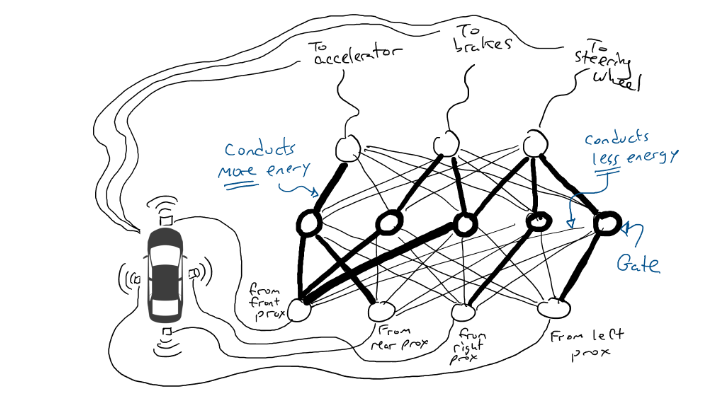

Tentar coisas aleatoriamente é uma droga. Um algoritmo chamado retropropagação é razoavelmente bom em fazer suposições sobre como mudar a configuração do circuito. Os detalhes do algoritmo não são importantes, exceto saber que ele faz pequenas mudanças no circuito para deixar o comportamento do circuito mais próximo de fazer o que os dados sugerem, e ao longo de milhares ou milhões de ajustes, pode eventualmente obter algo próximo de concordar com os dados.

Chamamos os resistores e gates de parâmetros porque, na realidade, eles estão em todos os lugares e o que o algoritmo de retropropagação está fazendo é declarar que cada resistor é mais forte ou mais fraco. Assim, o circuito inteiro pode ser reproduzido em outros carros se soubermos o layout dos circuitos e os valores dos parâmetros.

## O que é Deep Learning?

Deep Learning é um reconhecimento de que podemos colocar outras coisas em nossos circuitos além de resistores e gates. Por exemplo, podemos ter um cálculo matemático no meio do nosso circuito que soma e multiplica coisas antes de enviar eletricidade adiante. Deep Learning ainda usa a mesma técnica incremental básica de adivinhar parâmetros.

## O que é um modelo de linguagem?

Quando fizemos o exemplo do carro, estávamos tentando fazer com que nossa rede neural realizasse um comportamento que fosse consistente com nossos dados. Estávamos perguntando se poderíamos criar um circuito que manipulasse os mecanismos do carro da mesma forma que um motorista fez em circunstâncias semelhantes. Podemos tratar a linguagem da mesma forma. Podemos olhar para um texto escrito por humanos e imaginar se um circuito poderia produzir uma sequência de palavras que se parecesse muito com as sequências de palavras que os humanos tendem a produzir. Agora, nossos sensores disparam quando vemos palavras e nossos mecanismos de saída também são palavras.

O que estamos tentando fazer? Estamos tentando criar um circuito que adivinha uma palavra de saída, dado um monte de palavras de entrada. Por exemplo:

“Era uma vez ____”

parece que deveria preencher a lacuna com “tempo”, mas não com “tatu”.

Nós tendemos a falar sobre modelos de linguagem em termos de probabilidade. Matematicamente, escreveremos o exemplo acima como:

Se você não estiver familiarizado com a notação, não se preocupe. Isso é apenas conversa de matemática, significando a probabilidade ( P ) da palavra “tempo” dado (o símbolo de barra | significa dado ) um monte de palavras “uma vez”, “sobre” e “a”. Esperaríamos que um bom modelo de linguagem produzisse uma probabilidade maior da palavra “tempo” do que para a palavra “armadillo”.

Podemos generalizar isso para:

que significa apenas calcular a probabilidade da n -ésima palavra em uma sequência, dadas todas as palavras que vêm antes dela (palavras nas posições de 1 a n -1).

Mas vamos recuar um pouco. Pense em uma máquina de escrever antiga, do tipo com braços de percussão.

DALL-E2 fez esta imagem. Olhe para todos os braços de ataque!
Exceto que em vez de ter um braço de percussão diferente para cada letra, temos um percussor para cada palavra. Se a língua inglesa tem 50.000 palavras, então esta é uma grande máquina de escrever!

Em vez da rede para o carro, pense em uma rede similar, exceto que o topo do nosso circuito tem 50.000 saídas conectadas a braços de percussão, uma para cada palavra. Correspondentemente, teríamos 50.000 sensores, cada um detectando a presença de uma palavra de entrada diferente. Então, o que estamos fazendo no final do dia é escolher um único braço de percussão que obtém o sinal elétrico mais alto e essa é a palavra que vai no espaço em branco.

Aqui é onde estamos: se eu quiser fazer um circuito simples que receba uma única palavra e produza uma única palavra, eu teria que fazer um circuito que tivesse 50.000 sensores (um para cada palavra) e 50.000 saídas (uma para cada braço de percussão). Eu apenas conectaria cada sensor a cada braço de percussão para um total de 50.000 x 50.000 = 2,5 bilhões de fios.

:::info
Uma palavra para outra palavra

50.000 x 50.000

2,5 bilhões de fios.
:::

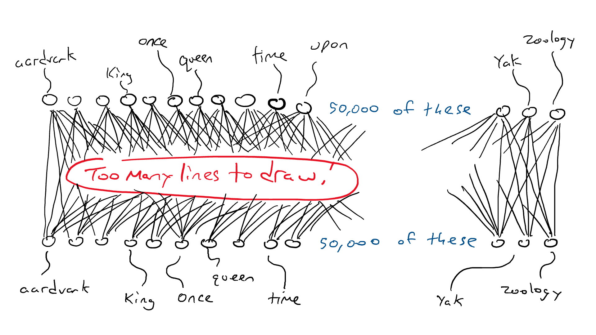

Cada círculo na parte inferior detecta uma palavra. São necessários 50.000 sensores para reconhecer a palavra “once”. Essa energia é enviada por alguma rede arbitrária. Todos os círculos na parte superior são conectados a braços de ataque para cada palavra. Todos os braços de ataque recebem alguma energia, mas um receberá mais do que os outros.
Essa é uma grande rede!

Mas piora. Se eu quiser fazer o exemplo “Era uma vez ___”, preciso sentir qual palavra está em cada uma das três posições de entrada. Eu precisaria de 50.000 x 3 = 150.000 sensores. Conectados a 50.000 braços de ataque, terei 150.000 x 50.000 = 7,5 bilhões de fios. Em 2023, a maioria dos grandes modelos de linguagem pode aceitar 4.000 palavras, com o maior aceitando 32.000 palavras. Meus olhos estão lacrimejando.

:::info
Três palavras para uma palavra

50.000 x 3 = 150.000

150.000 x 50.000

7,5 bilhões de fios
:::

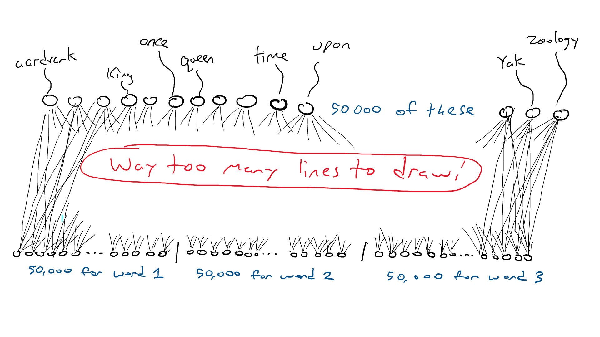

Uma rede que recebe três palavras como entrada requer 50.000 sensores por palavra.
Vamos precisar de alguns truques para lidar com essa situação. Vamos fazer as coisas em etapas.

## Codificadores

A primeira coisa que faremos é dividir nosso circuito em dois circuitos, um chamado encoder e outro chamado decoder . A ideia é que muitas palavras significam aproximadamente a mesma coisa. Considere as seguintes frases:

:::info
A ideia é que muitas palavras significam aproximadamente a mesma coisa.
:::

- O rei sentou-se no ___
- A rainha sentou-se no ___
- A princesa sentou-se no ___
- O regente sentou-se no ___

Um palpite razoável para todos os espaços em branco acima seria “trono” (ou talvez “banheiro”). O que quer dizer que eu não precisaria de fios separados entre “rei” e “trono”, ou entre “rainha” e “trono”, etc. Em vez disso, seria ótimo se eu tivesse algo que significasse aproximadamente realeza e toda vez que eu visse “rei” ou “rainha”, eu usasse essa coisa intermediária. Então eu só teria que me preocupar com quais palavras significam aproximadamente a mesma coisa e então o que fazer sobre isso (enviar muita energia para “trono”).

Então aqui está o que faremos. Vamos montar um circuito que pega 50.000 sensores de palavras e mapeia para um conjunto menor de saídas, digamos 256 em vez de 50.000. E em vez de poder acionar apenas um braço de ataque, podemos esmagar vários braços de uma vez. Cada combinação possível de braços de ataque pode representar um conceito diferente (como "realeza" ou "mamíferos blindados"). Essas 256 saídas nos dariam a capacidade de representar conceitos de 2²⁵⁶ = 1,15 x 10⁷⁸. Na realidade, é ainda mais porque, como no exemplo do carro, podemos pressionar os freios parcialmente, cada uma dessas 256 saídas pode ser não apenas 1,0 ou 0,0, mas qualquer número entre eles. Então, talvez a melhor metáfora para isso seja que todos os 256 braços de ataque esmagam para baixo, mas cada um esmaga para baixo com uma quantidade diferente de força.

Ok... então, anteriormente, uma palavra exigiria um de 50.000 sensores para disparar. Agora, fervemos um sensor ativado e 49.999 sensores desligados em 256 números. Então, "rei" pode ser [0,1, 0,0 , 0,9, …, 0,4] e "rainha" pode ser [0,1, 0,1 , 0,9, …, 0,4], que são quase iguais. Chamarei essas listas de números de codificações (também chamadas de estado oculto por razões históricas, mas não quero explicar isso, então ficaremos com a codificação). Chamamos o circuito que espreme nossos 50.000 sensores em 256 saídas de codificador . Parece com isso:

:::info
Encode

50.000 x 256

12,8 milhões
:::

Uma rede de codificadores que comprime os 50.000 valores de sensores necessários para detectar uma única palavra em uma codificação de 256 números (azul mais claro e mais escuro usado para indicar valores maiores ou menores).

## Decodificadores

Mas o codificador não nos diz qual palavra deve vir em seguida. Então, nós pareamos nosso codificador com uma rede de decodificadores . O decodificador é outro circuito que pega 256 números que compõem a codificação e ativa os 50.000 braços de percussão originais, um para cada palavra. Nós então escolheríamos a palavra com a maior saída elétrica. É assim que ficaria:

:::info
Decode

256 x 50.000

12,8 milhões
:::

Uma rede decodificadora, expandindo os 256 valores na codificação em valores de ativação para os 50.000 braços de ataque associados a cada palavra possível. Uma palavra ativa o mais alto.

## Codificadores e decodificadores juntos

Aqui está o codificador e o decodificador trabalhando juntos para formar uma grande rede neural:

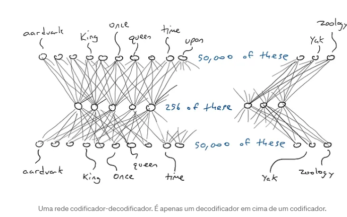

Uma rede codificador-decodificador. É apenas um decodificador em cima de um codificador.
E, a propósito, uma única entrada de palavra para uma única saída de palavra passando por codificação precisa apenas de (50.000 x 256) x 2 = 25,6 milhões de parâmetros. Isso parece muito melhor.

:::info
Encode-decode

(50.000 x 256) x 2

25,6 milhões de parâmetros

Antes tínhamos - Uma palavra para outra palavra:

50.000 x 50.000

2,5 bilhões de fios.
:::

Esse exemplo foi para uma entrada de palavra e produzindo uma saída de palavra, então teríamos 50.000 x n entradas se quiséssemos ler n palavras e 256 x n para a codificação

:::info
Encode de 3 palavras e decode de uma palavra

(50.000 x 256 x 3) + (50.000 x 256)

38.400 + 12.800

51,2 milhões de parâmetros

Antes tínhamos - Três palavras para uma palavra

50.000 x 3 = 150.000

150.000 x 50.000

7,5 bilhões de fios
:::

Mas por que isso funciona? Ao forçar 50.000 palavras a caberem em um pequeno conjunto de números, forçamos a rede a fazer concessões e agrupar palavras que podem disparar o mesmo palpite de palavra de saída. Isso é muito parecido com a compactação de arquivo. Quando você compacta um documento de texto, obtém um documento menor que não é mais legível. Mas você pode descompactar o documento e recuperar o texto original legível. Isso pode ser feito porque o programa zip substitui certos padrões de palavras por uma notação abreviada. Então, quando ele descompacta, ele sabe qual texto trocar de volta para a notação abreviada. Nossos circuitos codificadores e decodificadores aprendem uma configuração de resistores e portas que compactam e descompactam palavras.

:::info
Como se fosse compactar e descompactar um documento
:::

## Auto-Supervisão ()

Como sabemos qual codificação para cada palavra é melhor? Em outras palavras, como sabemos que a codificação para “rei” deve ser similar à codificação para “rainha” em vez de “armadillo”?

Como um experimento mental, considere uma rede codificadora-decodificadora que deve receber uma única palavra (50.000 sensores) e produzir exatamente a mesma palavra como saída. Isso é uma coisa boba de se fazer, mas é bem instrutiva para o que virá a seguir.

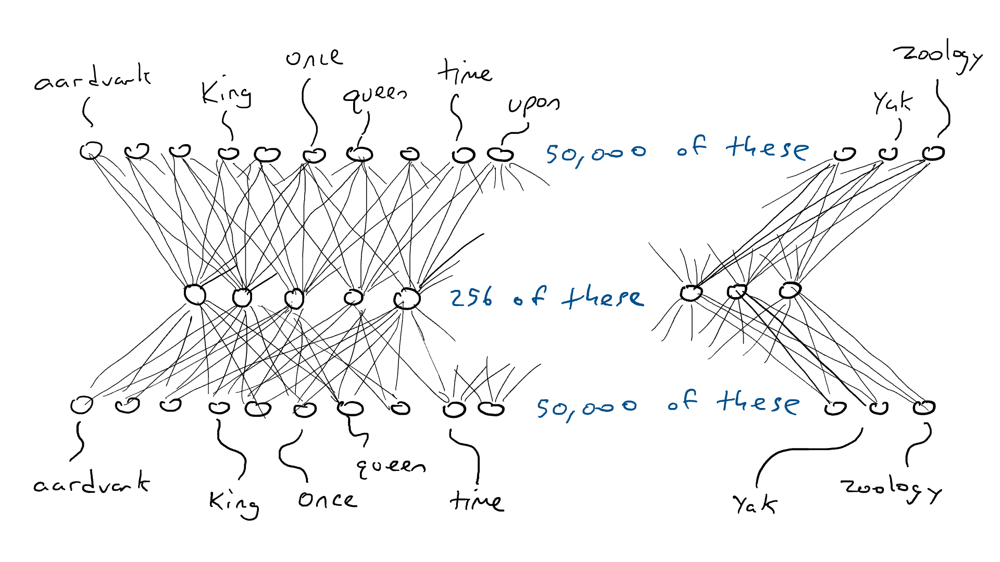

Uma rede codificadora-decodificadora treinada para gerar a mesma palavra que a entrada (é a mesma imagem de antes, mas com cor para ativação).

Eu coloco a palavra "rei" e um único sensor envia seu sinal elétrico através do codificador e liga parcialmente 256 valores na codificação no meio. Se a codificação estiver correta, o decodificador enviará o sinal elétrico mais alto para a mesma palavra, "rei". Certo, fácil? Não tão rápido. É tão provável que eu veja o braço da máquina de escrever com a palavra “armadillo” com a energia de ativação mais alta. Suponha que o braço da máquina de escrever para "rei" receba 0,051 de sinal elétrico e o braço atacante para “armadillo” receba 0,23 de sinal elétrico. Na verdade, nem me importo com o valor para “armadillo”. Posso apenas olhar para a energia de saída para "rei" e saber que não era 1,0. A diferença entre 1,0 e 0,051 é o erro (também chamado de perda ) e posso usar a retropropagação para fazer algumas alterações no decodificador e no codificador para que uma codificação ligeiramente diferente seja feita na próxima vez que virmos a palavra "rei".

Fazemos isso para todas as palavras. O codificador vai ter que fazer um acordo porque o 256 é bem menor que 50.000. Ou seja, algumas palavras vão ter que usar as mesmas combinações de energia de ativação no meio. Então, quando tiver a escolha, ele vai querer que a codificação para "rei" e "rainha" seja quase idêntica e a codificação para "“armadillo”" seja bem diferente. Isso dará ao decodificador uma chance melhor de adivinhar a palavra apenas olhando para os valores de codificação 256. E se o decodificador vir uma combinação particular de valores 256 e adivinhar "rei" com 0,43 e "rainha" com 0,42, vamos ficar bem com isso, desde que "rei" e "rainha" recebam os sinais elétricos mais altos e cada um dos 49.998 braços de ataque receba números menores. Outra maneira de dizer isso é que provavelmente ficaremos mais tranquilos se a rede ficar confusa entre reis e rainhas do que se a rede ficar confusa entre reis e “armadillos”.

Dizemos que a rede neural é autossupervisionada porque, diferentemente do exemplo do carro, você não precisa coletar dados separados para testar a saída. Apenas comparamos a saída com a entrada — não precisamos ter dados separados para a entrada e a saída.

## Modelos de Linguagem Mascarada

Se o experimento mental acima parece bobo, ele é um bloco de construção para algo chamado modelos de linguagem mascarada . A ideia de um modelo de linguagem mascarada é pegar uma sequência de palavras e gerar uma sequência de palavras. Uma das palavras na entrada e na saída são apagadas.

A [MÁSCARA] estava sentada no trono.

A rede adivinha todas as palavras. Bem, é bem fácil adivinhar as palavras desmascaradas. Nós só nos importamos com o palpite da rede sobre a palavra mascarada. Ou seja, temos 50.000 braços de striker para cada palavra na saída. Olhamos para os 50.000 braços de striker para a palavra mascarada.

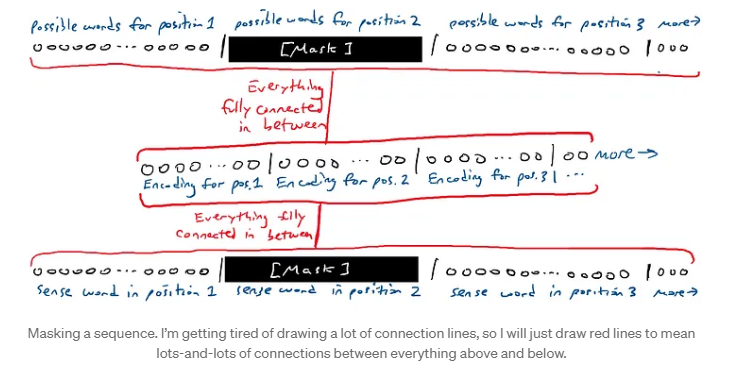

Mascarando uma sequência. Estou ficando cansado de desenhar muitas linhas de conexão, então vou desenhar apenas linhas vermelhas para significar muitas e muitas conexões entre tudo acima e abaixo.
Podemos mover a máscara e fazer com que a rede adivinhe palavras diferentes em lugares diferentes.

Um tipo especial de modelo de linguagem mascarada tem apenas a máscara no final. Isso é chamado de modelo generativo porque a máscara que ele está supondo é sempre a próxima palavra na sequência, o que é equivalente a gerar a próxima palavra como se a próxima palavra não existisse. Assim:

- A [MÁSCARA]
- A rainha [MÁSCARA]
- A rainha sentou-se [MÁSCARA]
- A rainha sentou-se em [MÁSCARA]
- A rainha sentou-se em [MÁSCARA]

Também chamamos isso de modelo autorregressivo . A palavra regressivo não soa tão bem. Mas regressão significa apenas tentar entender a relação entre as coisas, como palavras que foram inseridas e palavras que deveriam ser produzidas. Auto significa “self”. Um modelo autorregressivo é autopreditivo. Ele prevê uma palavra. Então essa palavra é usada para prever a próxima palavra, que é usada para prever a próxima palavra, e assim por diante. Há algumas implicações interessantes para isso, às quais voltaremos mais tarde.

## O que é um transformador?

No momento em que este texto foi escrito, ouvimos muito sobre coisas chamadas GPT-3 e GPT-4 e ChatGPT. GPT é uma marca particular de um tipo de modelo de linguagem grande desenvolvido por uma empresa chamada OpenAI. GPT significa Generative Pre-trained Transformer . Vamos decompor isso:

Generativo. O modelo é capaz de gerar continuações para a entrada fornecida. Ou seja, dado algum texto, o modelo tenta adivinhar quais palavras vêm em seguida.
Pré-treinado . O modelo é treinado em um corpus muito grande de texto geral e deve ser treinado uma vez e usado para muitas coisas diferentes sem precisar ser treinado novamente do zero.
Mais sobre pré-treinamento… O modelo é treinado em um corpus muito grande de texto geral que aparentemente cobre um grande número de tópicos concebíveis. Isso significa mais ou menos "raspado da internet" em vez de retirado de alguns repositórios de texto especializados. Ao treinar em texto geral, um modelo de linguagem é mais capaz de responder a uma gama mais ampla de entradas do que, por exemplo, um modelo de linguagem treinado em um tipo muito específico de texto, como de documentos médicos. Um modelo de linguagem treinado em um corpus geral pode teoricamente responder razoavelmente a qualquer coisa que possa aparecer em um documento na internet. Ele pode se sair bem com texto médico. Um modelo de linguagem treinado apenas em documentos médicos pode responder muito bem a entradas relacionadas a contextos médicos, mas ser muito ruim em responder a outras entradas, como bate-papo ou receitas.

Ou o modelo é bom o suficiente em tantas coisas que nunca é preciso treinar o próprio modelo, ou é possível fazer algo chamado ajuste fino , que significa pegar o modelo pré-treinado e fazer algumas atualizações para que ele funcione melhor em uma tarefa especializada (como médica).

Agora para o transformador…

Transformer. Um tipo específico de modelo de deep learning de codificador-decodificador autosupervisionado com algumas propriedades muito interessantes que o tornam bom em modelagem de linguagem.
Um transformador é um tipo particular de modelo de aprendizado profundo que transforma a codificação de uma forma particular que torna mais fácil adivinhar a palavra apagada. Foi introduzido por um artigo chamado Attention is All You Need por Vaswani et al. em 2017. No coração de um transformador está a rede clássica codificador-decodificador. O codificador faz um processo de codificação muito padrão. Tão simples que você ficaria chocado. Mas então ele adiciona outra coisa chamada autoatenção .

## Autoatenção

Aqui está a ideia de autoatenção: certas palavras em uma sequência estão relacionadas a outras palavras na sequência. Considere a frase "O alienígena pousou na Terra porque precisava se esconder em um planeta". Se mascarássemos a segunda palavra, "alienígena", e pedíssemos a uma rede neural para adivinhar a palavra, ela teria uma chance melhor por causa de palavras como "pousou" e "terra". Da mesma forma, se mascarássemos "isso" e pedíssemos à rede para adivinhar a palavra, a presença da palavra "alienígena" poderia torná-la mais propensa a preferir "isso" a "ele" ou "ela".

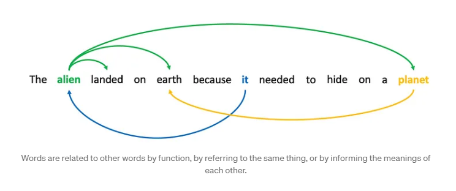

As palavras se relacionam com outras palavras por função, referindo-se à mesma coisa ou informando os significados umas das outras.
Dizemos que palavras em uma sequência atendem a outras palavras porque elas capturam algum tipo de relacionamento. O relacionamento não é necessariamente conhecido. Pode ser resolver pronomes, pode ser relação de verbo e sujeito, pode ser duas palavras relacionadas ao mesmo conceito (“terra” e “planeta”). Seja o que for, saber que há algum tipo de relação entre palavras é útil para previsão.

A próxima seção abordará a matemática da autoatenção, mas o ponto principal é que um transformador aprende quais palavras em uma sequência de entrada são relacionadas e, então, cria uma nova codificação para cada posição na sequência de entrada que é uma fusão de todas as palavras relacionadas. Você pode pensar nisso como aprender a criar uma nova palavra que é uma mistura de “alienígena” e “aterrado” e “terra” (aliandearth?). Isso funciona porque cada palavra é codificada como uma lista de números. Se alien = [0,1, 0,2, 0,3, …, 0,4] e landed = [0,5, 0,6, 0,7, …, 0,8] e earth = [0,9, 1,0, 1,1, …, 1,2], então a segunda posição da palavra pode ser codificada como a soma de todas essas codificações, [1,5, 1,8, 2,1, …, 2,4], que por si só não corresponde a nenhuma palavra, mas captura partes de todas as palavras. Dessa forma, quando o decodificador finalmente vê essa nova codificação para a palavra na segunda posição, ele tem muitas informações sobre como a palavra estava sendo usada na sequência e, portanto, faz uma estimativa melhor sobre quaisquer máscaras. (O exemplo apenas adiciona a codificação, mas será um pouco mais complicado do que isso).

## Como funciona a autoatenção?

Autoatenção é uma melhoria significativa em relação às redes de codificador-decodificador vanilla, então se você quiser saber mais sobre como isso funciona, continue lendo. Caso contrário, sinta-se à vontade para pular esta seção. TL;DR: autoatenção é um nome chique para a operação matemática chamada produto escalar .

A autoatenção acontece em três estágios.

(1) Codificamos cada palavra na sequência de entrada normalmente. Fazemos quatro cópias das codificações de palavras. Uma chamamos de residual e reservamos para guardar em segurança.

(2) Executamos uma segunda rodada de codificação (estamos codificando uma codificação) nos outros três. Cada um passa por um processo de codificação diferente, então todos se tornam diferentes. Chamamos um de consulta ( q ), um de chave ( k ) e um de valor ( v ).

Quero que você pense em uma tabela hash (também chamada de dicionário em python). Você tem um monte de informações armazenadas em uma tabela. Cada linha na tabela tem uma chave , algum identificador exclusivo e o valor , os dados sendo armazenados na linha. Para recuperar algumas informações da tabela hash, você faz uma consulta. Se a consulta corresponder à chave, você extrai o valor.

Uma tabela hash que pode ser usada para consultar em qual universidade um professor trabalha.
A autoatenção funciona um pouco como uma tabela hash fuzzy . Você fornece uma consulta e, em vez de procurar uma correspondência exata com uma chave, ela encontra correspondências aproximadas com base na similaridade entre consulta e chave. Mas e se a correspondência não for uma correspondência perfeita? Ela retorna alguma fração do valor. Bem, isso só faz sentido se a consulta, as chaves e os valores forem todos numéricos. Que são:

Uma tabela hash com correspondências parciais.
Então é isso que faremos. Para cada posição de palavra na entrada, pegaremos a codificação q e a codificação k e calcularemos a similaridade. Usamos algo chamado produto escalar, também chamado de similaridade de cosseno. Não é importante. O ponto é que cada palavra é uma lista de 256 números (com base em nosso exemplo anterior) e podemos calcular a similaridade das listas de números e registrar a similaridade em uma matriz. Chamamos essa matriz de pontuações de autoatenção . Se tivéssemos uma sequência de entrada de três palavras, nossas pontuações de atenção poderiam ser algo assim:

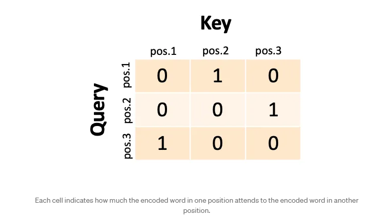

Cada célula indica o quanto a palavra codificada em uma posição atende à palavra codificada em outra posição.
A rede trata a primeira palavra como uma consulta e ela corresponde à segunda chave (podemos dizer que a primeira palavra está “atendendo” à segunda palavra). Se a segunda palavra fosse uma consulta, ela corresponderia à terceira chave. Se a terceira palavra fosse uma consulta, ela corresponderia à primeira chave. Na realidade, nunca teríamos uns e zeros assim; teríamos correspondências parciais entre 0 e 1 e cada consulta (linha) corresponderia parcialmente a várias chaves (colunas).

Agora, para continuar com a metáfora de recuperação, multiplicamos essa matriz contra as codificações v e algo interessante acontece. Suponha que nossas codificações v se parecessem com isso:

Cada linha é uma codificação para uma palavra em uma sequência.
Isto é, a primeira palavra foi codificada como uma lista de números 0,10…0,19, a segunda palavra foi codificada como uma lista de números 0,20…0,29, e a terceira palavra foi codificada como uma lista de números 0,30…0,39. Esses números são feitos para fins ilustrativos e nunca seriam tão arrumados.

Multiplicando atenção com valores.
A primeira consulta corresponde à segunda chave e, portanto, recupera a segunda palavra codificada. A segunda consulta corresponde à terceira chave e, portanto, recupera a terceira palavra codificada. A terceira consulta corresponde à primeira chave e, portanto, recupera a primeira palavra codificada. O que efetivamente fizemos foi trocar linhas!

Na prática, as pontuações não seriam uns e zeros perfeitos e o resultado seria um pouco de cada codificação misturada (por exemplo, 97% da palavra um mais 1% ou palavra três mais 2% da palavra dois). Mas isso ilustra como a autoatenção é uma mistura e troca. Nesta versão extrema, a primeira palavra foi trocada pela segunda palavra, e assim por diante. Então, talvez a palavra “terra” tenha sido trocada pela palavra “planeta”.

Como sabemos que codificamos q , k e v corretamente? Se a capacidade geral da rede de adivinhar a melhor palavra para a máscara melhorar, então estamos codificando q , k e v corretamente. Se não, alteramos os parâmetros para codificar um pouco diferente na próxima vez.

(3) A terceira coisa que fazemos é pegar o resultado de toda essa matemática e adicioná-lo ao residual. Lembre-se daquela primeira cópia da codificação original que deixamos de lado. Isso mesmo, adicionamos a versão misturada e trocada a ela. Agora, “terra” não é apenas uma codificação de “terra”, mas algum tipo de palavra imaginária que é uma mistura de “terra” e “planeta”… pearth? ealanet? Não é bem assim. De qualquer forma, esta é a codificação final transformada que será enviada ao decodificador. Provavelmente podemos concordar que ter uma palavra falsa em cada posição que realmente codifica duas ou mais palavras é mais útil para fazer previsões com base em uma única palavra por posição.

Depois, faça isso várias vezes, uma após a outra (várias camadas).

Estou deixando de fora muitos detalhes sobre como a codificação final do codificador entra no decodificador (outra rodada de atenção, chamada de atenção de fonte , onde as codificações do codificador de cada posição são usadas como q e k para serem aplicadas contra outra versão diferente de v ), mas neste ponto você deve ter uma ideia geral das coisas. No final, o decodificador, recebendo a codificação do codificador, envia energia para os braços do percussor para as palavras, e escolhemos a palavra mais fortemente energizada.

7. Por que os grandes modelos de linguagem são tão poderosos?
Então o que tudo isso significa? Grandes modelos de linguagem, incluindo ChatGPT, GPT-4 e outros, fazem exatamente uma coisa: eles pegam um monte de palavras e tentam adivinhar qual palavra deve vir a seguir. Se isso é “raciocínio” ou “pensamento”, então é apenas uma forma muito especializada.

Mas mesmo essa forma especializada parece muito poderosa porque o ChatGPT e similares podem fazer muitas coisas aparentemente muito bem: escrever poesia, responder perguntas sobre ciência e tecnologia, resumir documentos, rascunhar e-mails e até mesmo escrever código, para citar apenas algumas coisas. Por que eles deveriam funcionar tão bem?

O molho secreto é duplo. O primeiro já falamos: o transformador aprende a misturar contextos de palavras de uma forma que o torna realmente bom em adivinhar a próxima palavra. A outra parte do molho secreto é como os sistemas são treinados. Grandes Modelos de Linguagem são treinados em grandes quantidades de informações extraídas da internet. Isso inclui livros, blogs, sites de notícias, artigos da Wikipedia, discussões no Reddit, conversas em mídias sociais. Durante o treinamento, alimentamos um trecho de texto de uma dessas fontes e pedimos que ele adivinhe a próxima palavra. Lembre-se: autossupervisionado. Se ele adivinhar errado, ajustamos o modelo um pouco até que ele acerte. Se fôssemos pensar sobre o que um LLM é treinado para fazer, é produzir texto que poderia ter aparecido razoavelmente na internet. Ele não consegue memorizar a internet, então ele usa as codificações para fazer concessões e erra um pouco, mas espero que não muito.

É importante não subestimar o quão diverso é o texto na internet em termos de tópicos. Os LLMs já viram de tudo. Eles já viram bilhões de conversas sobre quase todos os tópicos. Então, um LLM pode produzir palavras que parecem estar conversando com você. Ele já viu bilhões de poemas e letras de música sobre quase tudo que é concebível, então ele pode produzir um texto que parece poesia. Ele já viu bilhões de tarefas de casa e suas soluções, então ele pode fazer suposições razoáveis ​​sobre sua tarefa, mesmo que ligeiramente diferentes. Ele já viu bilhões de perguntas de testes padronizados e suas respostas. Nós realmente achamos que as perguntas do SAT deste ano são tão diferentes das do ano passado? Ele viu pessoas falando sobre seus planos de férias, então ele pode adivinhar palavras que parecem planos de férias. Ele já viu bilhões de exemplos de código fazendo todo tipo de coisa. Muito do que os programadores de computador fazem é montar pedaços de código para fazer coisas muito típicas e bem compreendidas em pedaços maiores de código. Assim, os LLMs podem escrever esses pequenos trechos comuns para você. Ele viu bilhões de exemplos de códigos errados e suas correções no stackoverflow.com. Sim, então ele pode pegar seu código quebrado e sugerir correções. Ele viu bilhões de pessoas tuitando que tocaram em um fogão quente e queimaram os dedos, então os LLMs sabem um pouco de bom senso. Ele leu muitos artigos científicos, então ele pode adivinhar fatos científicos bem conhecidos, mesmo que eles não sejam bem conhecidos por você. Ele viu bilhões de exemplos de pessoas resumindo, reescrevendo texto em marcadores, descrevendo como tornar o texto mais gramatical, conciso ou persuasivo.

Aqui está o ponto: quando você pede ao ChatGPT ou outro Large Language Model para fazer algo inteligente — e funciona — há uma chance muito boa de que você tenha pedido para fazer algo que ele já viu bilhões de exemplos. E mesmo se você inventar algo realmente único como "me diga o que Flash Gordon faria depois de comer seis burritos" (isso é único, eu nem sei), ele viu Fan Fiction sobre Flash Gordon e viu pessoas falando sobre comer muitos burritos e pode — por causa da autoatenção — misturar e combinar pedaços e peças para montar uma resposta que soe razoável.

Nosso primeiro instinto ao interagir com um Large Language Model não deve ser "uau, essas coisas devem ser realmente inteligentes ou realmente criativas ou realmente compreensivas". Nosso primeiro instinto deve ser "Eu provavelmente pedi para ele fazer algo que ele já viu em pedaços antes". Isso pode significar que ele ainda é realmente útil, mesmo que não esteja "pensando muito" ou "fazendo algum raciocínio realmente sofisticado".

Não precisamos usar a antropomorfização para entender o que ela está fazendo para nos fornecer uma resposta.

Uma nota final sobre este tema: devido à maneira como os Large Language Models funcionam e à maneira como são treinados, eles tendem a fornecer respostas que são, de certa forma, a resposta mediana. Pode parecer muito estranho para mim dizer que o modelo tende a dar respostas medianas após pedir uma história sobre Flash Gordon. Mas no contexto de uma história, ou um poema, as respostas podem ser pensadas como sendo o que muitas pessoas (escrevendo na internet) inventariam se tivessem que se comprometer. Não será ruim. Pode ser muito bom para os padrões de uma única pessoa sentada tentando pensar em algo por conta própria. Mas suas histórias e poemas provavelmente também são medianos (mas são especiais para você). Desculpe.

## O que devo observar?

Há algumas implicações realmente sutis que surgem de como os Transformers funcionam e como são treinados. As seguintes são implicações diretas dos detalhes técnicos.

Grandes Modelos de Linguagem são treinados na internet. Isso significa que eles também foram treinados em todas as partes obscuras da humanidade. Grandes Modelos de Linguagem foram treinados em discursos racistas, discursos sexistas, insultos de todo tipo contra todo tipo de pessoa, pessoas fazendo suposições estereotipadas sobre outras, teorias da conspiração, desinformação política, etc. Isso significa que as palavras que um modelo de linguagem escolhe gerar podem regurgitar tal linguagem.

Grandes modelos de linguagem não têm “crenças centrais”. Eles são adivinhadores de palavras; eles estão tentando prever quais seriam as próximas palavras se a mesma frase aparecesse na internet. Assim, pode-se pedir a um grande modelo de linguagem para escrever uma frase a favor de algo, ou contra essa mesma coisa, e o modelo de linguagem obedecerá de ambas as maneiras. Essas não são indicações de que ele acredita em uma coisa ou outra, ou muda suas crenças, ou que uma está mais certa do que a outra. Se os dados de treinamento tiverem mais exemplos de uma coisa em relação a outra, então um grande modelo de linguagem tenderá a responder de forma mais consistente com o que aparecer em seus dados de treinamento com mais frequência, porque aparece na internet com mais frequência. Lembre-se: o modelo está se esforçando para emular a resposta mais comum.
Grandes Modelos de Linguagem não têm nenhum senso de verdade ou certo ou errado. Há coisas que consideramos fatos, como a Terra ser redonda. Um LLM tenderá a dizer isso. Mas se o contexto estiver certo, ele também dirá o oposto porque a internet tem texto sobre a Terra ser plana. Não há garantia de que um LLM fornecerá a verdade. Pode haver uma tendência a adivinhar palavras que concordamos serem verdadeiras, mas isso é o mais próximo que podemos chegar de fazer qualquer afirmação sobre o que um LLM “sabe” sobre a verdade ou o certo ou errado.

Grandes modelos de linguagem podem cometer erros. Os dados de treinamento podem ter muito material inconsistente. A autoatenção pode não atender a todas as coisas que queremos quando fazemos uma pergunta. Como um adivinhador de palavras, ele pode fazer suposições infelizes. Às vezes, os dados de treinamento viram uma palavra tantas vezes que preferem essa palavra mesmo quando ela não faz sentido para a entrada. O acima leva a um fenômeno que é chamado de " alucinação ", onde uma palavra é adivinhada que não é derivada da entrada nem "correta". Os LLMs têm inclinações para adivinhar números pequenos em vez de números grandes porque números pequenos são mais comuns. Então, os LLMs não são bons em matemática. Os LLMs têm uma preferência pelo número "42" porque os humanos têm por causa de um livro famoso em particular. Os LLMs têm preferências por nomes mais comuns, então podem inventar os nomes de autores.
Grandes modelos de linguagem são auto-regressivos. Assim, quando eles fazem suposições que podemos considerar ruins, essas palavras adivinhadas são adicionadas às suas próprias entradas para fazer a próxima palavra adivinhar. Ou seja: os erros se acumulam. Mesmo que haja apenas 1% de chance de erro, então a autoatenção pode atender a essa escolha errada e dobrar esse erro. Mesmo que apenas um erro seja cometido, tudo o que vem depois pode estar vinculado a esse erro. Então o modelo de linguagem pode cometer erros adicionais além disso. Os transformadores não têm uma maneira de "mudar de ideia" ou tentar novamente ou se autocorrigir. Eles seguem o fluxo.

Deve-se sempre verificar as saídas de um modelo de linguagem grande. Se você está pedindo para ele fazer coisas que você não pode verificar competentemente, então você deve pensar se está tudo bem em agir em quaisquer erros que sejam cometidos. Para tarefas de baixo risco, como escrever um conto, isso pode ser bom. Para tarefas de alto risco, como tentar obter informações para decidir em quais ações investir, talvez esses erros possam fazer com que você tome uma decisão muito custosa.

Autoatenção significa que quanto mais informações você fornecer no prompt de entrada, mais especializada será a resposta, porque ela misturará mais palavras suas em seus palpites. A qualidade da resposta é diretamente proporcional à qualidade do prompt de entrada. Melhores prompts produzem melhores resultados. Tente vários prompts diferentes e veja o que funciona melhor para você. Não presuma que o modelo de linguagem "entende" o que você está tentando fazer e dará o melhor de si na primeira vez.

Você não está realmente "tendo uma conversa" com um modelo de linguagem grande. Um modelo de linguagem grande não "lembra" o que aconteceu na troca. Sua entrada entra. A resposta sai. O LLM não lembra de nada. Sua entrada inicial, a resposta e sua resposta à resposta entram. Portanto, se parece que está se lembrando, é porque o log das conversas se torna uma nova entrada. Este é um truque de programação no front-end para fazer o Modelo de Linguagem Grande parecer que está tendo uma conversa. Ele provavelmente permanecerá no tópico por causa deste truque, mas não há garantia de que não contradirá suas respostas anteriores. Além disso, há um limite para quantas palavras podem ser alimentadas no modelo de linguagem grande (atualmente, o ChatGPT permite aproximadamente 4.000 palavras, e o GPT-4 permite aproximadamente 32.000 palavras). Os tamanhos de entrada podem ser muito grandes, então a conversa frequentemente parecerá permanecer coerente por um tempo. Eventualmente, o log acumulado ficará muito grande e o início da conversa será excluído e o sistema "esquecerá" coisas anteriores.

Grandes modelos de linguagem não resolvem problemas ou planejam. Mas você pode pedir que eles criem planos e resolvam problemas. Vou dividir alguns detalhes aqui. Resolução de problemas e planejamento são termos reservados por certos grupos na comunidade de pesquisa de IA para significar algo muito específico. Em particular, eles significam ter uma meta — algo que você quer realizar no futuro — e trabalhar para atingir essa meta fazendo escolhas entre alternativas que provavelmente nos levarão mais perto dessa meta. Grandes modelos de linguagem não têm metas. Eles têm um objetivo, que é escolher uma palavra que provavelmente apareceria nos dados de treinamento dada uma sequência de entrada. Eles são correspondências de padrões. O planejamento, em particular, geralmente envolve algo chamado look-ahead . Quando os humanos planejam, eles imaginam os resultados de suas ações e analisam esse futuro com relação à meta. Se parece que nos aproxima de uma meta, é uma boa jogada. Se não, podemos tentar imaginar os resultados de outra ação. Há muito mais do que isso, mas os pontos-chave são que os grandes modelos de linguagem não têm objetivos e não fazem look-ahead . Os transformadores são retrospectivos. A autoatenção só pode ser aplicada às palavras de entrada que já apareceram. Agora, os grandes modelos de linguagem podem gerar saídas que parecem planos porque eles viram muitos planos nos dados de treinamento. Eles sabem como os planos se parecem, eles sabem o que deve aparecer nos planos sobre certos tópicos que eles viram. Ele fará um bom palpite sobre esse plano. O plano pode ignorar detalhes particulares sobre o mundo e tender para o plano mais genérico. Os grandes modelos de linguagem certamente não "pensaram nas alternativas" ou tentaram uma coisa e voltaram atrás e tentaram outra coisa. Não há nenhum mecanismo dentro de um transformador que alguém possa apontar que faria tal consideração de ida e volta do futuro. (Há uma ressalva para isso, que surgirá na próxima seção.) Sempre verifique as saídas ao solicitar planos.

## O que torna o ChatGPT tão especial?

“Então ouvi dizer que RLHF é o que torna o ChatGPT realmente inteligente.”

“O ChatGPT usa aprendizado por reforço e é isso que o torna tão inteligente.”

Bem... mais ou menos.

No momento em que este texto foi escrito, havia muita empolgação sobre algo chamado RLHF, ou Reinforcement Learning with Human Feedback . Há algumas coisas que foram feitas para treinar o ChatGPT em particular (e cada vez mais outros Large Language Models). Elas não são exatamente novas, mas foram amplamente introduzidas com grande efeito quando o ChatGPT foi lançado.

O ChatGPT é um Transformer baseado em Large Language Model. O ChatGPT ganhou a reputação de ser muito bom em produzir respostas a prompts de entrada e por se recusar a responder perguntas sobre certos tópicos que podem ser considerados tóxicos ou opinativos. Ele não faz nada particularmente diferente do que foi descrito acima. Na verdade, é bem simples. Mas há uma diferença: como ele foi treinado. O ChatGPT foi treinado normalmente — raspando uma grande parte da internet, pegando trechos desse texto e fazendo o sistema prever a próxima palavra. Isso resultou em um modelo base que já era um preditor de palavras muito poderoso (equivalente ao GPT-3). Mas então houve duas etapas adicionais de treinamento. Ajuste de instruções e aprendizado por reforço com feedback humano.

## Ajuste de instruções

Há um problema específico com modelos de linguagem grandes: eles só querem pegar uma sequência de entrada de palavras e gerar o que vem a seguir. Na maioria das vezes, é isso que se quer. Mas nem sempre. Considere o seguinte prompt de entrada:

“Escreva um ensaio sobre Alexander Hamilton.”

O que você acha que a resposta deveria ser. Você provavelmente está pensando que deveria ser algo como “Alexander Hamilton nasceu em Nevis em 1757. Ele era um estadista, um advogado, coronel do Exército e o primeiro Secretário do Tesouro dos Estados Unidos…” Mas o que você pode realmente obter é:

“Seu ensaio deve ter pelo menos cinco páginas, espaço duplo e incluir pelo menos duas citações.”

O que aconteceu? Bem, o modelo de linguagem pode ter visto muitos exemplos de tarefas de alunos que começam com “Escreva uma redação sobre…” e incluem palavras detalhando o comprimento e a formatação. Claro que quando você escreveu “Escreva uma redação…” você estava pensando que estava escrevendo instruções para o modelo de linguagem como se fosse um humano que entendesse a intenção. Os modelos de linguagem não entendem sua intenção ou têm suas próprias intenções; eles apenas correspondem as entradas aos padrões que viram em seus dados de treinamento.

Para consertar isso, pode-se fazer algo chamado ajuste de instrução . A ideia é bem simples. Se você obtiver a resposta errada, anote qual deve ser a resposta correta e envie a entrada original e a nova saída corrigida pela rede neural como dados de treinamento. Com exemplos suficientes da saída corrigida, o sistema aprenderá a mudar seu circuito para que a nova resposta seja preferida.

Não é preciso fazer nada muito extravagante. Basta fazer com que muitas pessoas interajam com o grande modelo de linguagem e peçam para ele fazer muitas coisas e anotar as correções quando ele não se comportar corretamente. Então, colete todos os exemplos em que ele cometeu erros e as novas saídas corretas e faça mais treinamento.

Isso faz com que o modelo de linguagem grande aja como se entendesse a intenção dos prompts de entrada e aja como se estivesse seguindo instruções. Ele não está fazendo nada além de tentar adivinhar a próxima palavra. Mas agora os novos dados de treinamento o fazem adivinhar palavras que parecem mais responsivas à entrada.

## Aprendizagem por reforço a partir do feedback humano

O próximo passo no treinamento é o aprendizado por reforço a partir do feedback humano. Acho que isso vai exigir um pouco de explicação.

Aprendizado por reforço é uma técnica de IA tradicionalmente usada em algumas pesquisas de robótica e também em agentes de jogos virtuais (pense em sistemas de IA que podem jogar Xadrez, Go ou StarCraft). O aprendizado por reforço é especialmente bom em descobrir o que fazer quando recebe algo chamado recompensa . Recompensa é apenas um número que indica o quão bem ele está se saindo (+100 para se sair muito bem; -100 para se sair muito mal). No mundo real e em jogos, a recompensa é frequentemente dada raramente. Em um jogo, você pode ter que fazer muitos movimentos antes de ganhar algum ponto. Talvez você só ganhe pontos no final do jogo. No mundo real, simplesmente não há pessoas suficientes dizendo quando você está fazendo um bom trabalho (você está). A menos que você seja um cachorro (eles são todos bons meninos e meninas). A única coisa que você realmente precisa saber é que os sistemas de aprendizado por reforço tentam prever quanta recompensa futura eles receberão e, em seguida, escolhem a ação que provavelmente obterá mais recompensa futura. Não é totalmente diferente da maneira como alguém pode usar petiscos para cães para ensinar seu cão a se comportar.

Certo, guarde tudo isso e considere o seguinte prompt:

Em que Mark é especialista?

Suponha que a saída do modelo de linguagem seja:

Mark tem muitas publicações em inteligência artificial, gráficos e interação humano-computador.

Isso está apenas parcialmente correto. Eu não publico em gráficos. Eu realmente gostaria de dar um polegar para baixo, ou uma pontuação de -1. Mas apenas uma parte está errada: a palavra gráficos. Se eu dissesse ao sistema que a frase inteira está errada, o modelo de linguagem poderia aprender que todas essas palavras devem ser evitadas. Bem, muitas dessas palavras são razoáveis.

É aqui que entra o aprendizado por reforço. O aprendizado por reforço funciona tentando diferentes alternativas e vendo quais alternativas obtêm a maior recompensa. Suponha que eu pedisse para ele gerar três respostas diferentes para o prompt original.

Mark tem muitas publicações em inteligência artificial, gráficos e interação humano-computador.

Mark trabalhou em inteligência artificial, sistemas seguros de PNL e interação humano-computador.

Mark pesquisou inteligência artificial, IA de jogos e gráficos.

Eu poderia dar um polegar para baixo (-1) para a primeira alternativa, um polegar para cima (+1) para a segunda alternativa e um polegar para baixo (-1) para a terceira alternativa. Assim como jogar um jogo, um algoritmo de aprendizado por reforço pode olhar para trás e descobrir que a única coisa em comum que resulta em um -1 é a palavra "gráficos". Agora o sistema pode se concentrar nessa palavra e ajustar o circuito da rede neural para não usar essa palavra em conjunto com esse prompt de entrada específico.

Mais uma vez, faremos com que um grupo de pessoas interaja com o modelo de linguagem grande. Desta vez, daremos às pessoas três (ou mais) respostas possíveis. Podemos fazer isso pedindo ao modelo de linguagem grande para responder a um prompt várias vezes e introduzir um pouco de aleatoriedade na seleção dos braços de ataque (não se esqueceu deles, não é?). Em vez de escolher o braço de ataque mais ativado, às vezes podemos escolher o segundo ou terceiro braço de ataque mais ativado. Isso dá respostas de texto diferentes, e pedimos às pessoas para escolherem sua primeira resposta favorita, segunda favorita e assim por diante. Agora temos alternativas e números. Agora podemos usar o aprendizado por reforço para ajustar o circuito da rede neural.

[Na verdade, usamos esses feedbacks de polegar para cima e polegar para baixo para treinar uma segunda rede neural para prever se as pessoas darão um polegar para cima ou um polegar para baixo. Se essa rede neural for boa o suficiente para prever o que as pessoas preferirão, então podemos usar essa segunda rede neural para adivinhar se as respostas do modelo de linguagem podem receber polegar para cima ou polegar para baixo e usar isso para treinar o modelo de linguagem.]

O que o aprendizado por reforço faz? Ele trata a geração de texto como um jogo em que cada ação é uma palavra. No final de uma sequência, o modelo de linguagem é informado se ganhou alguns pontos ou perdeu alguns pontos. O modelo de linguagem não está exatamente fazendo uma previsão como discutido na seção anterior, mas foi, em certo sentido, treinado para prever quais palavras receberão aprovação. O Large Language Model ainda não tem um objetivo explícito, mas tem um objetivo implícito de "receber aprovação" (ou também poderíamos dizer que tem o objetivo implícito de "satisfazer a pessoa média") e aprendeu a correlacionar certas respostas a certos prompts com a obtenção de aprovação. Isso tem muitas qualidades de planejamento, mas sem um mecanismo explícito de previsão. Mais como se tivesse estratégias memorizadas para obter recompensas que tendem a funcionar em muitas situações.

Sobre o ponto principal de se o RLHF torna o ChatGPT mais inteligente... ele torna o ChatGPT mais propenso a produzir os tipos de respostas que esperávamos ver. Ele parece mais inteligente porque suas saídas parecem transmitir uma sensação de que ele entende as intenções de nossas entradas e tem suas próprias intenções de responder. Isso é uma ilusão porque ele ainda está apenas codificando e decodificando palavras. Mas, novamente, é aí que começamos este artigo 😉.

O ajuste de instruções e o RLHF também tornam o uso do ChatGPT resistente a certos tipos de abusos, como a geração de conteúdo racista, sexista ou politicamente carregado. Ainda pode ser feito e, em qualquer caso, versões mais antigas do GPT-3 sempre foram capazes de fazer isso. No entanto, como um serviço público gratuito, o atrito que o ChatGPT cria contra certos tipos de abuso transmite uma sensação de segurança. Ele também é resistente a fornecer opinião como fato, o que também elimina uma forma de danos potenciais ao usuário.

[Usar aprendizado por reforço para modificar um modelo de linguagem pré-treinado não é novidade. Ele pode ser rastreado até pelo menos 2016 e tem sido usado para tornar modelos de linguagem grandes mais seguros. A maioria dos ajustes baseados em aprendizado por reforço de modelos de linguagem grandes usa um segundo modelo para fornecer recompensa, o que também é feito com o ChatGPT. O que o ChatGPT é notável é a escala do sistema sendo ajustado com aprendizado por reforço e o esforço de coleta de feedback humano em larga escala.]

## Conclusões

Quando desenho redes neurais à mão, parece barbatana de baleia. De qualquer forma, espero ter conseguido filtrar um pouco do hype em torno dos Large Language Models.