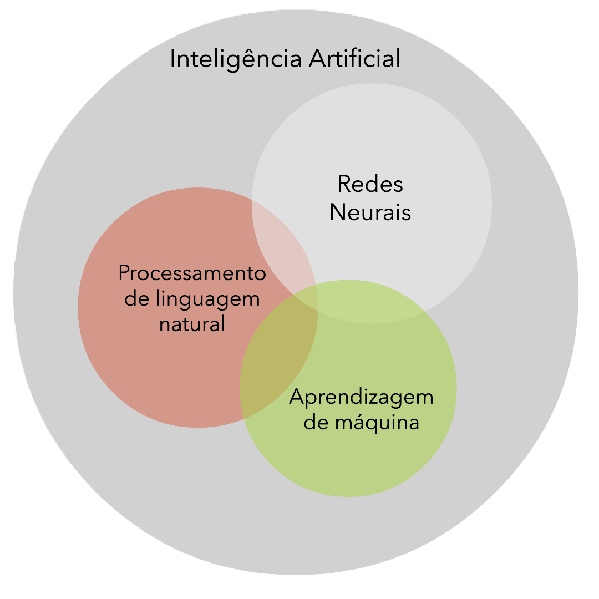

# PLN

## Sobre

Esse material é umta tradução em português brasileiro desse [artigo no medium](https://medium.com/@vipra_singh/llm-architectures-explained-nlp-fundamentals-part-1-de5bf75e553a) 

## O que é PLN?

Processamento de linguagem natural (PLN) é a disciplina de construção de máquinas que podem manipular a linguagem humana — ou dados que se assemelham à linguagem humana — da maneira como são escritos, falados e organizados.



A PNL é amplamente dividida em duas áreas sobrepostas:

Natural Language Understanding (NLU), que lida com a interpretação do significado por trás do texto, e

Natural Language Generation (NLG), que se concentra na produção de texto que imita a escrita humana. Embora seja diferente do reconhecimento de fala — que converte a linguagem falada em texto — a PNL geralmente trabalha em conjunto com ele.

## Aplicações da PNL

A PNL é usada para várias tarefas relacionadas à linguagem, incluindo responder perguntas, classificar texto de várias maneiras e conversar com usuários.

Aqui estão algumas das tarefas que a PNL pode resolver:

**Análise de Sentimentos**: Isso envolve determinar o tom emocional do texto. A entrada é tipicamente um pedaço de texto, e a saída é uma distribuição de probabilidade indicando se o sentimento é positivo, negativo ou neutro. As técnicas variam de métodos tradicionais como TF-IDF e n-grams a modelos de aprendizado profundo como BERT e LSTM.

**Classificação de Toxicidade**: Uma forma especializada de análise de sentimentos, a classificação de toxicidade identifica a intenção hostil e a categoriza em tipos específicos, como ameaças ou insultos. Isso é usado para moderar conteúdo online, garantindo espaços digitais mais seguros.

**Tradução de Máquina**: Isso automatiza a tradução de texto de um idioma para outro. Modelos avançados como o GPT-4 da OpenAI e os modelos baseados em Transformer do Google estão liderando o caminho para tornar as traduções mais precisas e contextualmente conscientes.

**Reconhecimento de Entidade Nomeada (NER)**: Os modelos NER extraem e classificam entidades como nomes, organizações e locais do texto. Esses modelos são essenciais para resumir notícias e combater a desinformação.

**Detecção de spam**: modelos de detecção de spam classificam e-mails como spam ou não, ajudando serviços de e-mail como o Gmail a filtrar mensagens indesejadas. Esses modelos geralmente dependem de técnicas como regressão logística, Naive Bayes ou aprendizado profundo (_deep learning_).

**Correção de erros gramaticais**: modelos que corrigem erros gramaticais são amplamente usados ​​em ferramentas como Grammarly. Eles tratam a correção gramatical como um problema de sequência para sequência, onde a entrada é uma frase incorreta e a saída é uma versão corrigida.

**Modelagem de tópicos**: a modelagem de tópicos identifica tópicos abstratos dentro de um corpus de documentos. Técnicas como Alocação de Dirichlet Latente (LDA) são comumente usadas em análise de documentos legais e sistemas de recomendação de conteúdo.

**Geração de texto (NLG)**: modelos NLG geram texto semelhante ao humano, útil para aplicativos que variam de chatbots à preenchimento automático. Preenchimento automático são sistemas que preveem a próxima palavra em uma sequência, usados ​​em aplicativos como mecanismos de busca e aplicativos de mensagens.  Chatbots simulam conversas humanas.

**Recuperação de informações**: envolve encontrar documentos relevantes para uma consulta, crucial para mecanismos de busca e sistemas de recomendação. Os modelos mais recentes do Google usam abordagens multimodais para lidar com dados de texto, imagem e vídeo simultaneamente.

**Resumo(Summarization)** é a tarefa de encurtar o texto para destacar as informações mais relevantes. O resumo é dividido em duas classes de métodos:

- O resumo extrativo foca em extrair as frases mais importantes de um texto longo e combiná-las para formar um resumo. Normalmente, o resumo extrativo pontua cada frase em um texto de entrada e então seleciona várias frases para formar o resumo.

- O resumo abstrativo produz um resumo por paráfrase. Isso é semelhante a escrever o resumo que inclui palavras e frases que não estão presentes no texto original. O resumo abstrativo é geralmente modelado como uma tarefa de sequência para sequência (sequence-to-sequence), onde a entrada é um texto longo e a saída é um resumo.

**Resposta a perguntas (QA)** lida com responder perguntas feitas por humanos em uma linguagem natural. Um dos exemplos mais notáveis ​​de resposta a perguntas foi Watson, que em 2011 jogou o game show de televisão Jeopardy contra campeões humanos e venceu por margens substanciais. Geralmente, as tarefas de resposta a perguntas vêm em dois tipos:

- Múltipla escolha: O problema de pergunta de múltipla escolha é composto de uma pergunta e um conjunto de respostas possíveis. A tarefa de aprendizagem é escolher a resposta correta.

-   Domínio aberto: Na resposta a perguntas de domínio aberto, o modelo fornece respostas a perguntas em linguagem natural sem nenhuma opção fornecida, geralmente consultando um grande número de textos.

## Termos da PLN

### Documento

Um documento é um único pedaço de texto, que pode ser qualquer coisa, desde uma única frase até um livro inteiro. É a unidade básica de texto que os modelos de PNL processam. Os documentos podem ser de natureza diversa, como e-mails, páginas da web, artigos ou tweets.

Exemplo:

- Um único artigo de notícias de um jornal.
- Um tweet: "Acabei de assistir a um filme incrível!"
- Um e-mail: "Caro John, espero que este e-mail o encontre bem..."

### Corpus (Corpora)

Um corpus (plural: corpora) é uma grande coleção de documentos. Ele serve como o conjunto de dados no qual os modelos de PNL são treinados e avaliados. Um corpus normalmente contém documentos relacionados por tópico, idioma ou gênero e é usado para analisar padrões linguísticos e construir modelos estatísticos.

Exemplo:

- Uma coleção de todos os artigos de um jornal específico ao longo de um ano.
- Um conjunto de dados de avaliações de clientes de um site de comércio eletrônico.
- O Corpus de Gutenberg: Uma coleção de textos literários do Projeto Gutenberg.

### Recurso (Feature)

Um recurso (feature) é uma propriedade ou característica mensurável do texto que é usada em modelos de aprendizado de máquina. Os recursos (features) são extraídos de documentos e podem representar vários aspectos do texto, como a presença de palavras específicas, o comprimento das frases ou a ocorrência de padrões específicos.

Exemplo:

#### Bag-of-Words (BoW): 

Cada palavra no vocabulário é um recurso (feature), e o valor é a contagem da palavra no documento.

Documento: 
```
"Eu amo PNL."
```

Recursos/features: 
```
[ "Eu": 1, "amo": 1, "PNL": 1 ]
```

#### Frequência de termo-frequência inversa do documento (TF-IDF): 

Uma medida estatística usada para avaliar a importância de uma palavra em um documento em relação a um corpus.

Documento: 

```
"Aprendizado de máquina é divertido."
```

Recursos/features (pontuações TF-IDF): 
```
[ "máquina": 0.5, "Aprendizado": 0.5, "é": 0.1, "divertido": 0.7 ]
```

#### Tags de Classe de Fala (Part of Speech/POS): 

Características que indicam a categoria gramatical de cada palavra (por exemplo, substantivo, verbo, adjetivo).

Documento: 

```
“A rápida raposa marrom salta.”
```

Características: 

```
[A”: “DET”, “rápida: “ADJ”, “marrom”: “ADJ”, “fox”: “raposa”, “jumps”: “VERB”]
```

Por exemplo, vamos considerar os 2 documentos mostrados abaixo:

```
Dog hates a cat. 
It loves to go out and play. Cat loves to play with a ball.
```

Podemos construir um corpus a partir dos 2 documentos acima apenas combinando-os.

```
Corpus = “Dog hates a cat. It loves to go out and play. Cat loves to play with a ball.”
```

E as características serão todas palavras únicas:

```
features: [‘and’, ‘ball’, ‘cat’, ‘dog’, ‘go’, ‘hates’, ‘it’, ‘loves’, ‘out’, ‘play’, ‘to’, ‘with’]
```

Chamaremos isso de vetor de características/recursos/feature. 

## Pré-processamento de dados

Antes que um modelo processe o texto para uma tarefa específica, o texto geralmente precisa ser pré-processado para melhorar o desempenho do modelo ou para transformar palavras e caracteres em um formato que o modelo possa entender. Várias técnicas podem ser usadas neste pré-processamento de dados:

### Tokenização

O processo de dividir o texto em unidades menores chamadas tokens, que podem ser palavras, subpalavras ou caracteres.

Tipos:

**Tokenização de palavras**: dividir o texto em palavras individuais. 

Exemplo:

```
"I study Machine Learning on GeeksforGeeks."
```

será tokenizada por palavra como

```
[‘I’, ‘study’, ‘Machine’, ‘Learning’, ‘on’, ‘GeeksforGeeks’, ‘.’]
```

**Tokenização de frase**: Dividir texto em frases individuais. 

Exemplo:

```
“Eu estudo Machine Learning no GeeksforGeeks. Atualmente, estou estudando PNL”
```

será tokenizada por frase como

```
[‘Eu estudo Machine Learning no GeeksforGeeks.’, ‘Atualmente, estou estudando PNL.’]
```

**Tokenização de subpalavra**: Dividir palavras em unidades menores, como prefixos, sufixos ou caracteres individuais.

Importância: A tokenização é o primeiro passo em muitos pipelines de PNL e afeta os estágios de processamento subsequentes.