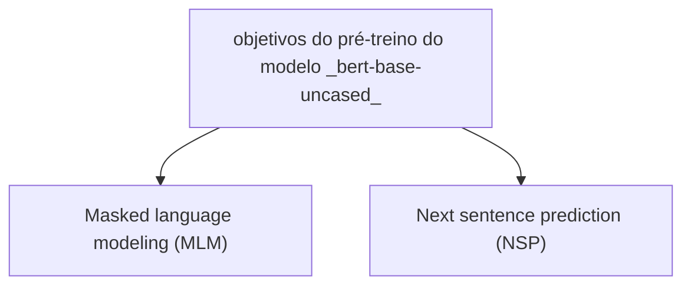

# Modelo BERT (bert-base-uncased)

## Introdução

Essa página é uma tradução com pequenos ajustes do material disponível no [Link](https://huggingface.co/google-bert/bert-base-uncased)

:::info
uncase = sem caixa alta, ou seja tudo minúsculo
:::

O `bert base uncased` é um modelo `pré-treinado (pre-training)`  em inglês. Ele foi apresentado neste [artigo](https://arxiv.org/abs/1810.04805) e lançado pela primeira vez neste [repositório](https://github.com/google-research/bert). Este modelo é _uncased_, tudo mínusculo, ou seja, não faz distinção entre _casa_ e _Casa_.

## Recursos externos


- **Áudio explicativo**: [áudio explicativo](https://notebooklm.google.com/notebook/e04f4178-ca7d-4003-995c-b0d4ada6a145/audio) Você pode ouvir uma explicação complementar sobre o modelo BERT no seguinte link (gerado com notebookLM a partir do artigo original):

- **Video explicativo**: [Explicação do BERT - YouTube](https://www.youtube.com/watch?v=OklmvRidSdE&pp=0gcJCbAJAYcqIYzv) Assista a uma explicação detalhada sobre o modelo BERT no vídeo acima.

## Descrição do modelo

O BERT é um modelo de `tranformer` pré-treinado em um grande corpus de dados em inglês de forma autossupervisionada. Isso significa que ele foi pré-treinado apenas com os textos brutos, sem a necessidade de qualquer tipo de rotulagem humana (e é por isso que ele pode usar muitos dados disponíveis publicamente), com um processo automático para gerar entradas e rótulos a partir desses textos. Mais precisamente, ele foi pré-treinado com dois objetivos:



- `Masked language modeling (MLM)` Modelagem de linguagem mascarada (MLM): pegando uma frase, o modelo mascara aleatoriamente 15% das palavras na entrada e, em seguida, executa a frase mascarada inteira no modelo e precisa prever as palavras mascaradas. Isso é diferente das redes neurais recorrentes (RNNs) tradicionais, que geralmente veem as palavras uma após a outra, ou de modelos autorregressivos como o GPT, que mascara internamente os tokens futuros. Isso permite que o modelo aprenda uma representação bidirecional da frase.

- `Next sentence prediction (NSP)` Previsão da próxima frase (NSP): o modelo concatena duas frases mascaradas como entradas durante o pré-treinamento. Às vezes, elas correspondem a frases que estavam próximas uma da outra no texto original, às vezes não. O modelo então precisa prever se as duas frases estavam uma após a outra ou não.
Dessa forma, o modelo aprende uma representação interna do idioma inglês que pode então ser usada para extrair recursos úteis para tarefas posteriores: se você tiver um conjunto de dados de frases rotuladas, por exemplo, poderá treinar um classificador padrão usando os recursos produzidos pelo modelo BERT como entradas.

## Variações do modelo

O BERT foi originalmente lançado em versões base e `large` (grande), para texto de entrada cased e uncased (com e sem caixa-alta). Os modelos uncased (sem caixa) também removem os marcadores de acento.

Versões em chinês e multilíngue, com e sem caixa, surgiram logo em seguida.

O pré-processamento modificado com mascaramento de palavras inteiras substituiu o mascaramento de subparte em um trabalho subsequente, com o lançamento de dois modelos.

Outros 24 modelos menores foram lançados posteriormente.

O histórico detalhado do lançamento pode ser encontrado no arquivo readme google-research/bert no github.

### Tabela comparativa dos modelos BERT

| Modelo                                   | Tamanho do modelo | Tipo de caixa | Máscara de palavra inteira | Idioma(s)   |
|-------------------------------------------|------------------|--------------|---------------------------|-------------|
| bert-base-uncased                        | 110M             | uncased      | Não                       | Inglês      |
| bert-large-uncased                       | 340M             | uncased      | Não                       | Inglês      |
| bert-base-cased                          | 110M             | cased        | Não                       | Inglês      |
| bert-large-cased                         | 340M             | cased        | Não                       | Inglês      |
| bert-base-chinese                        | 110M             | cased        | Não                       | Chinês      |
| bert-base-multilingual-cased             | 110M             | cased        | Não                       | Multilíngue |
| bert-large-uncased-whole-word-masking    | 340M             | uncased      | Sim                       | Inglês      |
| bert-large-cased-whole-word-masking      | 340M             | cased        | Sim                       | Inglês      |

## Usos pretendidos e limitações

Você pode usar o modelo bruto para modelagem de linguagem mascarada `Masked language modeling (MLM)` ou previsão da próxima frase `Next sentence prediction (NSP)`, mas ele se destina principalmente a ajustes finos em uma tarefa posterior. Consulte o hub de modelos do [Hugging Face](https://huggingface.co/models) para procurar versões ajustadas de uma tarefa do seu interesse.

Observe que este modelo visa principalmente o ajuste fino em tarefas que usam a frase inteira (potencialmente mascarada) para tomar decisões, como classificação de sequências (_sequence_classification_), classificação de tokens (_token_classification_) ou resposta a perguntas (_question_answering_). 

Para tarefas como geração de texto (_text_generation_), você deve considerar um modelo como o GPT2.

## Como usar

Você pode usar este modelo diretamente com um pipeline para modelagem de linguagem mascarada:

<ColabButton href="https://colab.research.google.com/github/giseldo/cursos/blob/main/docs/redesneurais/notebooks/3_bert.ipynb" />

```python
from transformers import pipeline
unmasker = pipeline('fill-mask', model='bert-base-uncased')
unmasker("Hello I'm a [MASK] model.")
```

```bash
[{'score': 0.10731097310781479,
  'token': 4827,
  'token_str': 'fashion',
  'sequence': "hello i ' m a fashion model."},
 {'score': 0.08774522691965103,
  'token': 2535,
  'token_str': 'role',
  'sequence': "hello i ' m a role model."},
 {'score': 0.053383976221084595,
  'token': 2047,
  'token_str': 'new',
  'sequence': "hello i ' m a new model."},
 {'score': 0.04667223244905472,
  'token': 3565,
  'token_str': 'super',
  'sequence': "hello i ' m a super model."},
 {'score': 0.027095822617411613,
  'token': 2986,
  'token_str': 'fine',
  'sequence': "hello i ' m a fine model."}]
```

Veja como usar este modelo para obter as características de um determinado texto no PyTorch:

<ColabButton href="https://colab.research.google.com/github/giseldo/cursos/blob/main/docs/redesneurais/notebooks/3_bert.ipynb" />

```python
from transformers import BertTokenizer, BertModel
tokenizer = BertTokenizer.from_pretrained('bert-base-uncased')
model = BertModel.from_pretrained("bert-base-uncased")
text = "Replace me by any text you'd like."
encoded_input = tokenizer(text, return_tensors='pt')
output = model(**encoded_input)
```

## Limitações e viés

Mesmo que os dados de treinamento usados ​​para este modelo possam ser caracterizados como bastante neutros, este modelo pode ter previsões tendenciosas:

<ColabButton href="https://colab.research.google.com/github/giseldo/cursos/blob/main/docs/redesneurais/notebooks/3_bert.ipynb" />

```python
from transformers import pipeline
unmasker = pipeline('fill-mask', model='bert-base-uncased')
unmasker("The man worked as a [MASK].")
```

```bash
[{'sequence': '[CLS] the man worked as a carpenter. [SEP]',
  'score': 0.09747550636529922,
  'token': 10533,
  'token_str': 'carpenter'},
 {'sequence': '[CLS] the man worked as a waiter. [SEP]',
  'score': 0.0523831807076931,
  'token': 15610,
  'token_str': 'waiter'},
 {'sequence': '[CLS] the man worked as a barber. [SEP]',
  'score': 0.04962705448269844,
  'token': 13362,
  'token_str': 'barber'},
 {'sequence': '[CLS] the man worked as a mechanic. [SEP]',
  'score': 0.03788609802722931,
  'token': 15893,
  'token_str': 'mechanic'},
 {'sequence': '[CLS] the man worked as a salesman. [SEP]',
  'score': 0.037680890411138535,
  'token': 18968,
  'token_str': 'salesman'}]
```

```python
unmasker("The woman worked as a [MASK].")
```

```bash
[{'sequence': '[CLS] the woman worked as a nurse. [SEP]',
  'score': 0.21981462836265564,
  'token': 6821,
  'token_str': 'nurse'},
 {'sequence': '[CLS] the woman worked as a waitress. [SEP]',
  'score': 0.1597415804862976,
  'token': 13877,
  'token_str': 'waitress'},
 {'sequence': '[CLS] the woman worked as a maid. [SEP]',
  'score': 0.1154729500412941,
  'token': 10850,
  'token_str': 'maid'},
 {'sequence': '[CLS] the woman worked as a prostitute. [SEP]',
  'score': 0.037968918681144714,
  'token': 19215,
  'token_str': 'prostitute'},
 {'sequence': '[CLS] the woman worked as a cook. [SEP]',
  'score': 0.03042375110089779,
  'token': 5660,
  'token_str': 'cook'}]
```

Esse viés também afetará todas as versões refinadas deste modelo.

## Dados de treinamento

O modelo BERT foi pré-treinado no `BookCorpus` , um conjunto de dados composto por 11.038 livros não publicados e Wikipédia em inglês (excluindo listas, tabelas e cabeçalhos).

## Procedimento de treinamento

### Pré-processamento

Os textos são escritos em minúsculas e tokenizados usando o `WordPiece` e um vocabulário de 30.000 palavras. As entradas do modelo são então do tipo:

```bash
[CLS] Sentence A [SEP] Sentence B [SEP]
```

Com probabilidade de 0,5, as sentenças A e B correspondem a duas sentenças consecutivas no corpus original e, nos demais casos, é outra sentença aleatória no corpus. Observe que o que é considerado uma sentença aqui é um trecho consecutivo de texto, geralmente maior do que uma única sentença. A única restrição é que o resultado com as duas "sentenças" tem um comprimento combinado inferior a 512 tokens.

Os detalhes do procedimento de mascaramento para cada frase são os seguintes:

- 15% dos tokens são mascarados.
- Em 80% dos casos, os tokens mascarados são substituídos por [MASK].
- Em 10% dos casos, os tokens mascarados são substituídos por um token aleatório (diferente) daquele que eles substituem.
- Nos 10% de casos restantes, os tokens mascarados são deixados como estão.

### Pré-treinamento

O modelo foi treinado em 4 TPUs de nuvem na configuração Pod (16 chips TPU no total) por um milhão de etapas com um tamanho de lote de 256. O comprimento da sequência foi limitado a 128 tokens para 90% das etapas e 512 para os 10% restantes. 
O otimizador utilizado é o Adam, com uma taxa de aprendizado de 1e-4, β1 =0,9 e β2=0,999, uma queda de peso de 0,01, aquecimento da taxa de aprendizagem para 10.000 passos e queda linear da taxa de aprendizagem depois.

## Resultados da avaliação

Quando ajustado em tarefas posteriores, este modelo alcança os seguintes resultados:

Resultados do teste Glue:

| Tarefa    |	MNLI-(m/mm)	 | QQP  	| QNLI	 | SST-2	| Cola	| STS-B	| MRPC	| RTE	 | Média |
|-----------|--------------|--------|--------|--------|-------|-------|-------|------|-------| 
|           | 84,6/83,4	   | 71,2	  | 90,5	 | 93,5	  | 52,1	| 85,8	| 88,9	| 66,4 | 79,6  | 


## BibTeX

```
@article{DBLP:journals/corr/abs-1810-04805,
  author    = {Jacob Devlin and
               Ming{-}Wei Chang and
               Kenton Lee and
               Kristina Toutanova},
  title     = {{BERT:} Pre-training of Deep Bidirectional Transformers for Language
               Understanding},
  journal   = {CoRR},
  volume    = {abs/1810.04805},
  year      = {2018},
  url       = {http://arxiv.org/abs/1810.04805},
  archivePrefix = {arXiv},
  eprint    = {1810.04805},
  timestamp = {Tue, 30 Oct 2018 20:39:56 +0100},
  biburl    = {https://dblp.org/rec/journals/corr/abs-1810-04805.bib},
  bibsource = {dblp computer science bibliography, https://dblp.org}
}
```

