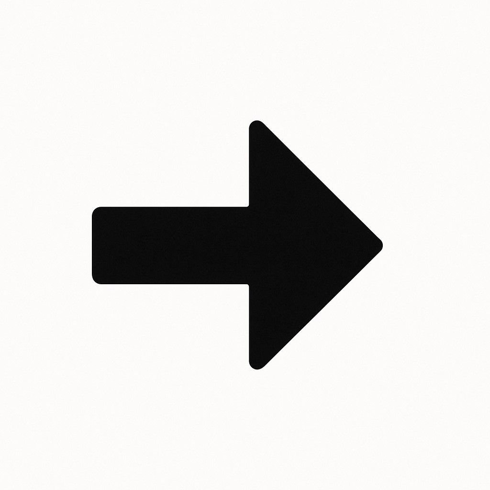

# **Curso Completo de Streamlit**

:::info
Criado por Alana Neo.
:::

:::info
<div style="display: flex; gap: 10px; align-items: center;">
  
  
  Você pode usar as setas do teclado para navegar entre as seções.
</div>
:::

## Introdução ao Streamlit

### O que é Streamlit?


Imagine que você tem um script Python que faz uma análise de dados. Com o **Streamlit**, você transforma esse script em um site interativo — sem precisar saber nada de HTML, CSS ou JavaScript.

> É como criar uma interface para o seu código, de forma simples e rápida.

---

### Por que usar Streamlit?

Você usaria o Streamlit porque:

* É **fácil de aprender** — comandos simples em Python.
* Não precisa saber **frontend**.
* Funciona muito bem com bibliotecas como Pandas, Matplotlib, Scikit-learn etc.
* Fazer o deploy é só um comando!
* A comunidade está crescendo muito rápido!

---

## Componentes Básicos

### Widgets Interativos

Widgets são **componentes visuais** como botões, campos de texto e sliders. Eles permitem **interagir** com o usuário.

---

#### Texto e Títulos

```python
st.title("Título Principal")
```

Esse comando mostra um **título grande** na tela.
Você também pode usar:

* `st.header()` → título médio
* `st.subheader()` → título pequeno
* `st.text()` → texto simples
* `st.markdown()` → usa formatação tipo Markdown

---

#### Inputs

Agora vamos **capturar dados do usuário**!

```python
nome = st.text_input("Digite seu nome")
```

Isso cria uma caixinha para o usuário digitar o nome.
Outros exemplos:

* Número: `st.number_input()`
* Slider: `st.slider()`
* Checkbox: `st.checkbox()`
* Lista suspensa: `st.selectbox()`

---

### Exercício 1

**Crie um formulário de cadastro com:**

* Nome (texto)
* Email (texto)
* Idade (número)
* Gênero (selectbox)
* Aceitar termos (checkbox)

**Dica:** Use um `st.form()` para agrupar os campos!

## Conclusão

Parabéns! Você aprendeu a:

* Criar apps interativos
* Usar componentes visuais
